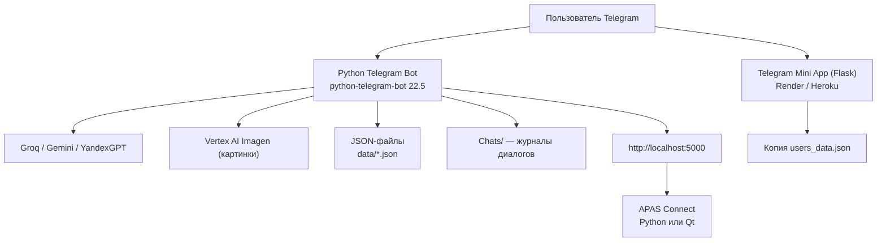

<p align="center">
  
  
  
  
</p>

# APAS — Telegram Bot Ecosystem

**APAS** (Адаптивная Аналитическая Предиктивная Система) — экспериментальная
экосистема вокруг Telegram-бота с мультимодельным ИИ. Проект включает в себя
сам бот, мини-приложение для Telegram, два десктопных клиента-моста «APAS
Connect» (Python и Qt/C++) и четыре интеграции с ИИ-провайдерами.

> ## ⚠️ CANARY RELEASE
>
> Это **первая публичная версия с открытым исходным кодом** (`0.1.0-canary`).
> Версия крайне нестабильная, содержит задокументированные баги, уязвимости и
> не предназначена для production-эксплуатации. Публикуется в ознакомительных,
> исследовательских и образовательных целях.
>
> **Обязательно ознакомьтесь с [известными проблемами](docs/KNOWN-ISSUES.md)
> и обоими [аудитами](#-аудиты-безопасности) перед запуском.**
>
> Секреты, обнаруженные при аудите, из репозитория исключены, но **токены,
> которые могли попасть в руки третьих лиц, рекомендуется отозвать и
> перевыпустить**.

---

## 📑 Оглавление

- [О проекте](#-о-проекте)
- [Возможности](#-возможности)
- [Команды бота](#-команды-бота)
- [Архитектура](#-архитектура)
- [Технологический стек](#-технологический-стек)
- [Структура проекта](#-структура-проекта)
- [Быстрый старт](#-быстрый-старт)
- [Конфигурация](#-конфигурация)
- [Telegram Mini App](#-telegram-mini-app)
- [APAS Connect](#-apas-connect)
- [Хранение данных](#-хранение-данных)
- [ИИ-модели](#-ии-модели)
- [Известные проблемы](#-известные-проблемы)
- [Аудиты безопасности](#-аудиты-безопасности)
- [Дорожная карта](#-дорожная-карта)
- [Версионирование](#-версионирование)
- [Лицензия и контакты](#-лицензия-и-контакты)

---

## 🤖 О проекте

Проект задуман как «песочница» — экспериментальная площадка для проверки идей:
мультимодельный ИИ-ассистент в Telegram, система профилей и очков, отчёты о
проблемах, интеграция карт и погоды, генерация изображений, «персональный
психолог», режим ИИ-ассистента с голосовым помощником Яндекса и генератор
мини-приложений.

Экосистема состоит из пяти компонентов:

| Компонент | Описание |
|---|---|
| **Telegram Bot** | Основной компонент: ИИ-чат, профили, очки, отчёты, команды (Python, `python-telegram-bot`) |
| **Mini App** | Telegram Web App для просмотра профиля, очков и настроек (Flask, деплой на Render/Heroku) |
| **APAS Connect (Python)** | Десктопный мост ПК↔бот: системная информация по HTTP API, трей-иконка (Flask + pystray + tkinter) |
| **APAS Connect (Qt)** | Ремейк на Qt 6 / C++ (Widgets + Network + WinAPI) |
| **ИИ-модули** | Groq, Google Gemini, YandexGPT, Vertex AI (Imagen) |

---

## ✨ Возможности

### ИИ-общение

- **Мультимодельный агрегатор** — выбор из 18+ моделей трёх провайдеров
  через команду `/models`: Groq (GPT OSS, Qwen, Llama, Kimi), Gemini 2.0/2.5,
  YandexGPT 4/5/5.1.
- **Потоковая генерация** (`streaming`) в реальном времени для моделей Groq —
  ответ редактируется по мере генерации. Режим настраивается в `/settings`.
- **Персонализация** — динамический системный промпт с именем, возрастом и
  городом пользователя.
- **Кнопка «Повторить»** при ошибке генерации и «Сообщить об ошибке».
- **Поддержка HTML-разметки** в ответах (жирный, курсив, моноширинный,
  цитаты, спойлеры).
- **Журнал диалогов** — каждая беседа сохраняется в `Chats/<user_id>/chat.txt`.

### Пользователи и профили

- **Онбординг в два режима**: простой (3 шага: имя + уведомления) и расширенный
  (5 шагов: имя, возраст, город, уведомления).
- **Гостевой режим** — вход без регистрации с ограничением команд.
- **Профиль** (`/profile`): имя, возраст, город, username; редактирование
  инлайн-кнопками, шаринг профиля по ссылке, «удаление» аккаунта.
- **Система очков** (`/points`): баланс, история транзакций с пагинацией,
  начисление администратором (`/addpoints`).
- **Уведомления** (`/notifications`): обновления, изменения, промо-рассылки.

### Отчёты о проблемах

- **Подача отчёта** (`/report`) с категориями (генерация текста, профиль,
  карты, погода, другое) и статусами.
- **Мои отчёты** (`/myreports`) — просмотр по статусам.
- **Админ-панель** (`/reports`) — фильтры, пагинация, смена статусов, архив.

### Геосервисы

- **Arc Maps** (`/maps`, геолокация): места рядом (OpenStreetMap Nominatim)
  по категориям (магазины, еда, достопримечательности, медицина, финансы),
  настройка категорий и расстояния, кнопка «Такси» (ссылка Яндекс.Go),
  определение города по координатам.
- **Arc Weather** (кнопка «Погода» в картах и в Mini App): прогноз.
  > ⚠️ В текущей версии погода — **заглушка** (моковые данные).

### Развлечения и сервисы

- **ISS Play** (`/games`) — «лаунчер» игр: регистрация игрового профиля с
  генерацией никнеймов через Groq и привязкой аккаунта.
- **Blum** (`/blum`) — «персональный психолог» с приветствием по времени суток.
- **Режим «Алисы»** (`/alice`) — ИИ-ассистент на YandexGPT (Lite/Pro) с
  интеграцией Яндекс Музыки: поиск треков, «Моя волна», чарты, плейлисты.
- **Генерация изображений** (`/image`) — Imagen 3.0 через Google Vertex AI.
  > ⚠️ В v0.1 команда **не зарегистрирована** в обработчиках бота (см.
  > [известные проблемы](docs/KNOWN-ISSUES.md)).

### Администрирование

- `/tools` — системные операции: очистка `__pycache__`, компиляция кода,
  остановка бота (требует секретную фразу).
- `/createpost` — создание поста и массовая рассылка по категориям и
  подпискам (критические — всем пользователям).
- `/addpoints` — начисление очков с выбором получателя.
- `/reports` — панель управления отчётами.
- `/remote` — системная информация с ПК через локальный APAS Connect.

### Прочее

- `/commands` — справка по всем командам.
- `/about` — информация о системе.
- `/iss` — статистика системы ISS (зарегистрированные пользователи).
- `/acc_stat` — статус учётной записи и права доступа.
- `/start`, `/signup`, `/guest` — регистрация и гостевой вход.
- `/settings` — переключение потоковой генерации.

---

## 💬 Команды бота

| Команда | Доступ | Описание |
|---|---|---|
| `/start` | Все | Регистрация (простая/расширенная) или приветствие |
| `/guest` | Все | Войти в гостевом режиме |
| `/signup` | Гости | Перейти к регистрации |
| `/commands` | Все | Список команд |
| `/about` | Все | О системе APAS |
| `/profile` | Пользователи | Профиль: просмотр, редактирование, шаринг |
| `/points` | Пользователи | Баланс и история очков |
| `/models` | Пользователи | Выбор ИИ-модели |
| `/settings` | Пользователи | Настройки (потоковая генерация) |
| `/notifications` | Пользователи | Подписка на рассылки |
| `/report` | Пользователи | Подать отчёт о проблеме |
| `/myreports` | Пользователи | Мои отчёты |
| `/games` | Пользователи | ISS Play: игровой профиль |
| `/blum` | Пользователи | «Персональный психолог» |
| `/alice` | Пользователи | Режим ИИ-ассистента (ЯндексGPT + Музыка) |
| `/acc_stat` | Пользователи | Статус учётной записи |
| `/iss` | Пользователи | Статистика ISS |
| `/remote` | Все ⚠️ | Информация о ПК через APAS Connect |
| `/reports` | Админ | Панель отчётов |
| `/addpoints` | Админ | Начисление очков |
| `/createpost` | Админ | Создание и рассылка постов |
| `/tools` | Админ | Системные операции |

---

## 🏗 Архитектура



### Ключевые архитектурные особенности

- **Единая точка маршрутизации** — все callback-кнопки обрабатываются в
  `main.py` (`button_callback`): около 60 типов callback-данных.
- **Хранилище — JSON-файлы** без БД: `users_data.json`, `points_transactions.json`,
  `reports.json`, `iss_play_accounts.json`, `alice_states.json`.
- **Мультипровайдерный ИИ** — модули `Models/groq.py`, `Models/gemini.py`,
  `Models/yandex.py` с единой точкой диспетчеризации `generate_ai_response()`.
- **Потоковая генерация** — только для Groq: асинхронная очередь
  `asyncio.Queue` + `run_in_executor`, сообщение редактируется по фрагментам.
- **Несколько копий данных** — Mini App работает со своей (устаревшей) копией
  `users_data.json`, что является задокументированным ограничением v0.1.

---

## 🛠 Технологический стек

| Технология | Назначение |
|---|---|
| **Python 3.7+** (практически 3.10+) | Основной язык |
| **python-telegram-bot 22.5** | Telegram Bot API |
| **Groq SDK 0.33.0** | ИИ: GPT OSS, Qwen, Llama, Kimi (со стримингом) |
| **google-generativeai 0.8.5** | Gemini 2.0/2.5 ⚠️ deprecated, EOL 30.11.2025 |
| **google-cloud-aiplatform / vertexai** | Imagen 3.0 ⚠️ генеративные модули удалены после 24.06.2026 |
| **requests 2.32.5** | HTTP-клиент (YandexGPT, API) |
| **python-dotenv 1.1.1** | Загрузка `.env` |
| **yandex-music 2.1.0** | Яндекс Музыка (режим «Алисы») |
| **Pillow 10.0.1** | Изображения, иконки |
| **Flask 3.1.2** | Mini App |
| **gunicorn** | Mini App на Render/Heroku |
| **OpenStreetMap Nominatim** | Геокодинг и места рядом (бесплатный API) |
| **psutil / pystray / tkinter** | APAS Connect (Python) |
| **Qt 6.9.3 / C++17 / MSVC / CMake** | APAS Connect (Qt-ремейк, Windows) |
| **HTML5 / CSS3 / JS (Telegram WebApp SDK)** | Mini App frontend |

---

## 📁 Структура проекта

```
Bot/
├── main.py                 # Точка входа бота: роутер команд и callback
├── shared.py               # Общие утилиты: users_data, admin, промпты
├── requirements.txt        # Зависимости бота
├── .env.example            # Шаблон конфигурации (скопировать в .env)
├── .gitignore
├── LICENSE                 # MIT
├── CHANGELOG.md            # История версий
├── README.md
├── docs/                   # Документация и аудиты
│   ├── ARCHITECTURE.md
│   ├── AUDIT-01-deepseek.md
│   ├── AUDIT-02-codex.md
│   └── KNOWN-ISSUES.md
├── Commands/               # 22 модуля команд бота (~5 200 строк)
│   ├── about.py            #   /about
│   ├── acc_stat.py         #   /acc_stat
│   ├── addpoints.py        #   /addpoints (админ, очки)
│   ├── blum.py             #   /blum (психолог)
│   ├── commands.py         #   /commands
│   ├── createpost.py       #   /createpost (админ, рассылка)
│   ├── games.py            #   /games (ISS Play)
│   ├── generator.py        #   генератор мини-приложений ⚠️ не подключён
│   ├── guest.py            #   /guest, /signup
│   ├── image.py            #   /image (Imagen) ⚠️ не зарегистрирована
│   ├── iss.py              #   /iss
│   ├── models.py           #   /models (агрегатор ИИ)
│   ├── myreports.py        #   /myreports
│   ├── notifications.py    #   /notifications
│   ├── points.py           #   /points
│   ├── profile.py          #   /profile
│   ├── remote.py           #   /remote (APAS Connect)
│   ├── report.py           #   /report
│   ├── reports.py          #   /reports (админ)
│   ├── settings.py         #   /settings
│   ├── start.py            #   /start (онбординг)
│   └── tools.py            #   /tools (админ)
├── Models/                 # ИИ-провайдеры
│   ├── groq.py             #   Groq (8 моделей, стриминг)
│   ├── gemini.py           #   Gemini (6 моделей)
│   ├── yandex.py           #   YandexGPT (4 модели)
│   └── src/                #   Логотипы моделей
├── Modes/
│   └── Alice/
│       ├── alice.py        # Режим «Алисы» (YandexGPT)
│       ├── yamusic.py      # ⚠️ старая версия (не используется)
│       └── Commands/
│           └── yamusic.py  # Актуальная интеграция Яндекс Музыки
├── Modules/
│   ├── arc_maps.py         # Карты: Nominatim, категории, такси (730 строк)
│   └── arc_weather.py      # Погода ⚠️ мок-заглушка
├── Mini App/               # Telegram Web App (Flask)
│   ├── app.py              # API: профиль, погода, настройки
│   ├── index.html          # Страница профиля
│   ├── points.html         # Страница очков
│   ├── settings.html       # Страница настроек
│   ├── styles.css
│   ├── Procfile / runtime.txt / requirements.txt
│   └── src/                # SVG-иконки
├── data/                   # JSON-хранилища (не публикуются)
├── Chats/                  # Журналы диалогов (не публикуются)
├── src/
│   ├── config.py           # Загрузка .env
│   └── blum.jpg            # Фото для /blum
└── APAS Connect/           # Python-мост ПК↔бот
    ├── main.py             # Flask API + трей + tkinter
    ├── main_old.py         # ⚠️ старая версия
    ├── build_exe.py        # PyInstaller-сборка
    ├── APAS_Connect.spec
    ├── config.example.json # Шаблон конфигурации
    ├── test_api.py         # Тест API
    └── src/                # Иконки
└── APAS Connect Qt/        # Qt/C++ ремейк
    ├── CMakeLists.txt
    ├── main.cpp
    ├── MainWindow.cpp/.h
    ├── HttpServer.cpp/.h
    ├── SystemMonitor.cpp/.h
    └── TrayIcon.cpp/.h
```

---

## 🚀 Быстрый старт

### Требования

- Python 3.10+ (рекомендуется 3.12/3.13; README оригинального проекта заявляет
  3.7+, но текущие зависимости требуют новее)
- Токен Telegram-бота от [@BotFather](https://t.me/BotFather)
- API-ключи: [Groq](https://console.groq.com/), [Gemini](https://aistudio.google.com/),
  [Yandex Cloud](https://console.yandex.cloud/) (опционально)

### Установка и запуск

```bash
# 1. Клонировать репозиторий
git clone https://github.com/pavelrakcheev/APAS-Telegram-Bot.git
cd APAS-Telegram-Bot

# 2. Создать виртуальное окружение и активировать
python3 -m venv .venv
source .venv/bin/activate        # macOS/Linux
.venv\Scripts\activate           # Windows

# 3. Установить зависимости
pip install -r requirements.txt

# 4. Создать конфигурацию из шаблона
cp .env.example .env
#    ... и заполнить своими ключами

# 5. Запустить бота
python main.py
```

> ⚠️ `requirements.txt` содержит строку `google-cloud-aiplatform-` без версии
> (известная проблема v0.1) — при необходимости поставьте её явно, например
> `google-cloud-aiplatform==1.90.1`.

### Минимальная конфигурация

Для работы бота достаточно двух ключей в `.env` (проверяется в `src/config.py`):

```
TELEGRAM_BOT_TOKEN=...
GROQ_API_KEY=...
```

Остальные ключи включают дополнительные возможности (Gemini, YandexGPT,
Imagen, Яндекс Музыка, администрирование).

---

## ⚙️ Конфигурация

Все переменные окружения загружаются из `.env` через `python-dotenv`
(см. `.env.example`):

| Переменная | Обязательна | Назначение |
|---|---|---|
| `TELEGRAM_BOT_TOKEN` | ✅ | Токен бота от @BotFather |
| `GROQ_API_KEY` | ✅ | Основной ИИ-провайдер |
| `GEMINI_API_KEY` | — | Модели Gemini |
| `GOOGLE_CLOUD_PROJECT` | — | Vertex AI (Imagen) |
| `GOOGLE_CLOUD_LOCATION` | — | Регион Vertex AI (по умолчанию `us-central1`) |
| `YANDEX_API_KEY` | — | YandexGPT Foundation Models |
| `YANDEX_MUSIC_ADMIN_TOKEN` | — | Яндекс Музыка для режима «Алисы» |
| `TELEGRAM_ID` | — | ID администратора (доступ к `/tools`, `/reports`, ...) |
| `ADMIN_PASSWORD` | — | Секретная фраза администратора |

---

## 📱 Telegram Mini App

Мини-приложение «ISS Profile Mini App» — отдельный Flask-сервис, открываемый
в Telegram через WebApp-кнопку.

**Страницы:**
- `index.html` — профиль: логотип ISS, блок очков, погода, данные ISS-профиля,
  данные Telegram (`initDataUnsafe`), кнопки «Редактировать» и «Поделиться».
- `points.html` — баланс очков (в v0.1 — заглушка с захардкоженным значением).
- `settings.html` — 4 тумблера: стриминг и уведомления (обновления, изменения,
  промо).

**API (Flask):**

| Метод | Путь | Описание |
|---|---|---|
| GET | `/api/user-profile?user_id=` | Профиль пользователя (403 без `setup_completed`) |
| GET | `/api/weather` | Погода (координаты захардкожены — Москва; данные моковые) |
| GET | `/api/user-settings?user_id=` | Настройки пользователя |
| POST | `/api/user-settings` | Сохранение настроек |
| GET | `/api/debug` | Отладочная информация ⚠️ **уязвимость v0.1** |

**Деплой на Render (или Heroku):**

```bash
# Render: создайте Web Service из папки Mini App
# Build command:  (пусто)
# Start command:  gunicorn app:app
```

Для Heroku/Render используется `Procfile` (`web: gunicorn app:app`) и
`runtime.txt` (python-3.11.6).

> ⚠️ В v0.1 Mini App **не проверяет подпись Telegram initData** и доверяет
> переданному `user_id` — это задокументированная критическая уязвимость.
> Перед публикацией Mini App в реальной среде исправьте её (см. аудиты).

---

## 💻 APAS Connect

Десктопный мост между ПК и ботом: бот запрашивает `http://localhost:5000/system_info`
по команде `/remote`, приложение отдаёт данные о системе.

### Python-версия (Flask + pystray + tkinter)

```bash
cd "APAS Connect"
pip install -r requirements.txt   # ⚠️ строка tkinter в requirements сломает pip — удалите её
python main.py
```

- **API:** `GET /system_info` (hostname, ОС, CPU, RAM, диск, батарея) и `GET /ping`.
- **GUI:** трей-иконка с меню, главное окно, адаптивные иконки под тему Windows.
- **Сборка в exe:** `python build_exe.py` → `dist/APAS_Connect.exe` (PyInstaller).
- Конфигурация — `config.json` (см. `config.example.json`).
  > ⚠️ В `config.json` оригинального проекта лежал реальный токен бота —
  > он исключён из репозитория и требует ротации.

### Qt-версия (Qt 6 / C++17 / MSVC / CMake)

```bash
cd "APAS Connect Qt"
cmake -S . -B build
cmake --build build --config Release
```

- Рукописный HTTP-сервер на `QTcpServer` (порт 5000, только `GET /system_info`).
- Системный монитор на WinAPI: CPU (`GetSystemTimes`), RAM
  (`GlobalMemoryStatusEx`), диск C: (`GetDiskFreeSpaceEx`), uptime
  (`GetTickCount64`), IP-адреса.
- Трей-иконка с меню Show/Quit, тёмная/светлая тема.
- ⚠️ Известные баги v0.1: проверка API на порту 8080 вместо 5000,
  запуск несуществующих `check_models.py`/`check_vertexai.py`, UI-фриз до 40 c.

---

## 🗄 Хранение данных

В v0.1 данные хранятся в JSON-файлах без БД (все файлы в `data/`):

| Файл | Содержимое |
|---|---|
| `users_data.json` | Пользователи: имя, возраст, город, username, очки, настройки, выбранная модель |
| `points_transactions.json` | История начислений очков (кто, кому, сколько, когда) |
| `reports.json` | Отчёты о проблемах со статусами |
| `iss_play_accounts.json` | Игровые аккаунты ISS Play |
| `alice_states.json` | Состояния режима «Алисы» (активность, модель, диалог) |

Плюс каталог `Chats/<user_id>/chat.txt` — журналы диалогов открытым текстом.

> ⚠️ Все эти файлы исключены из репозитория как содержащие персональные данные.
> Известные ограничения v0.1: нет блокировок при записи, нет миграций и схем,
> относительные пути зависят от рабочей директории.

---

## 🧠 ИИ-модели

| Провайдер | Модуль | Модели в v0.1 | Стриминг |
|---|---|---|---|
| **Groq** | `Models/groq.py` | GPT OSS 20B/120B, Kimi K2, Qwen3 32B, Llama 3.1/3.3/4 Maverick/Scout | ✅ |
| **Google Gemini** | `Models/gemini.py` | Gemini 2.0 Flash Exp/Lite, 2.5 Flash/Lite/Pro | ❌ |
| **YandexGPT** | `Models/yandex.py` | YandexGPT 4 Lite, 5 Lite, 5 Pro, 5.1 Pro | ❌ |
| **Google Imagen** | `Commands/image.py` | Imagen 3.0 (Vertex AI) | — |

> ⚠️ По состоянию на 2026 год часть моделей отключена провайдерами:
> Groq — Kimi K2, Qwen3 32B, Llama 4 Maverick/Scout, Llama 3.1/3.3
> (депрецированы); Gemini — 2.0 Flash/Exp/Lite (отключены), 2.5-линия
> планируется к отключению; YandexGPT 4 — отсутствует в актуальном каталоге.
> Выбор модели — в `/models`, модель по умолчанию — `openai/gpt-oss-120b`.

---

## 🐞 Известные проблемы

Подробный перечень всех задокументированных багов, уязвимостей и ограничений
v0.1 — в [docs/KNOWN-ISSUES.md](docs/KNOWN-ISSUES.md). Краткая сводка:

### Критические (безопасность)

1. **Секреты в истории проекта** — токены Telegram/Groq/Gemini/Yandex,
   пароль администратора, PFX с приватным ключом. Из репозитория исключены,
   но требуют ротации.
2. **Mini App без авторизации** — нет проверки Telegram `initData`, API
   доверяет `user_id` клиента, открыт `/api/debug`, CORS для всех доменов.
   **Подтверждена доступность уязвимости на опубликованном сервисе.**
3. **IDOR в myreports** — детальный просмотр отчётов загружает данные по
   `user_id` из callback без проверки владельца (в v0.1 скрыт ошибкой
   маршрутизации).
4. **`/remote` без проверки прав** — любой пользователь получает данные
   хост-машины.

### Функциональные

5. **Сломана админ-панель отчётов** — `report_` перехватывает
   `report_detail_`; `is_guest_mode()` вызывается без аргумента (TypeError);
   смена статусов и детальный просмотр недоступны.
6. **`/image` не зарегистрирована** в обработчиках `main.py`.
7. **Гостевые callback-кнопки** (`guest_back`, `guest_commands`) обращаются
   к отсутствующему `update.message`.
8. **Погода — мок**, карты используют приблизительные диапазоны городов.
9. **Часть ИИ-моделей отключена** провайдерами (см. выше).
10. **«Удаление профиля» не удаляет данные** — остаются чаты, отчёты, очки.
11. **Alice теряет состояние** после перезапуска (int/str ключи в JSON).
12. **Мёртвые кнопки**: `image_edit`, `blum_settings`, `report_send_empty`,
    `addpoints_confirm`.
13. **Дублирование кода**: reports/points/users_data реализованы в 2–4 местах.

---

## 🔒 Аудиты безопасности

Перед публикацией проект прошёл два независимых аудита. Полные отчёты
документированы в репозитории:

| # | Аудит | Инструмент | Отчёт |
|---|---|---|---|
| 1 | **Аудит №1** | **DeepSeek V4 Flash (Max)** в OpenCode Desktop | [docs/AUDIT-01-deepseek.md](docs/AUDIT-01-deepseek.md) |
| 2 | **Аудит №2** | **ChatGPT Codex (GPT-5.6 Sol High) + Codex Security** | [docs/AUDIT-02-codex.md](docs/AUDIT-02-codex.md) |

### Резюме аудитов

- **Аудит №1 (DeepSeek):** общий аудит структуры, функций и мусора.
  Обнаружены: секреты в `.env` и `config.json`, IDOR в myreports,
  уязвимость `/remote`, мёртвый `generator.py` с path traversal и `eval()`,
  дублирование кода, 99,5% папки — пересобираемый мусор (660 МБ).
- **Аудит №2 (Codex + Codex Security):** углублённый аудит безопасности.
  Подтвердил аудит №1 и добавил: сломанную маршрутизацию callback отчётов
  (IDOR скрыт ошибкой роутера), PFX с приватным ключом, live-уязвимость
  Mini App на Render (`/api/debug` + CORS), mass assignment в настройках,
  ложное удаление профиля, перебор публичных профилей, депрецированные
  ИИ-модели и SDK (`google-generativeai`, Vertex AI), отсутствие `/image`
  в обработчиках, гостевые callback-баги.

> ⚠️ Все секреты, фигурировавшие в аудитах, считаются скомпрометированными.
> Перед любым реальным запуском: отзовите токены (BotFather — токен бота,
> консоли провайдеров — API-ключи), смените пароль администратора и
> удалите PFX-сертификаты из распространяемых материалов.

---

## 🗺 Дорожная карта

Планируемые направления развития (в порядке приоритета):

1. **Security remediation** — закрыть Mini App (initData, CORS, `/api/debug`),
   починить маршрутизацию отчётов, добавить авторизацию в myreports/remote.
2. **Переход на актуальные SDK** — `google-genai` вместо `google-generativeai`,
   актуальный Vertex AI SDK, обновление PTB/Groq, фильтрация депрецированных
   моделей.
3. **Данные** — миграция на SQLite/PostgreSQL или атомарные JSON-записи с
   блокировками; реализация настоящего удаления аккаунта.
4. **Инфраструктура** — тесты, CI (lint, pip-audit, secret scan), lock-файлы.
5. **Функциональность** — реальная погода, реальные игры, рабочий генератор
   мини-приложений, командное меню (`setMyCommands`), webhook-режим.

---

## 🔖 Версионирование

Проект использует [Semantic Versioning](https://semver.org/lang/ru/).

- `0.1.0-canary` — первая публичная версия (текущая).
- Префикс `canary` означает экспериментальный характер релиза.
- Изменения фиксируются в [CHANGELOG.md](CHANGELOG.md).

---

## 📄 Лицензия и контакты

- **Лицензия:** [MIT](LICENSE)
- **Автор:** Pavel Rakcheev ([GitHub](https://github.com/pavelrakcheev))
- **Бот в Telegram:** [@Intelligence_playground_bot](https://t.me/Intelligence_playground_bot)

Проект публикуется «как есть» (AS IS), без каких-либо гарантий.
Используйте на свой страх и риск — это экспериментальная песочница.
