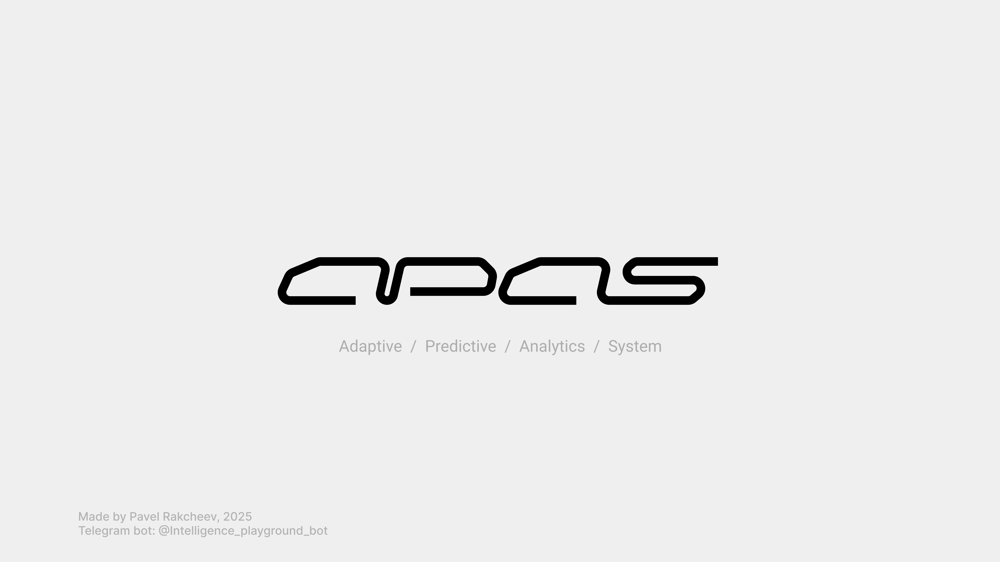
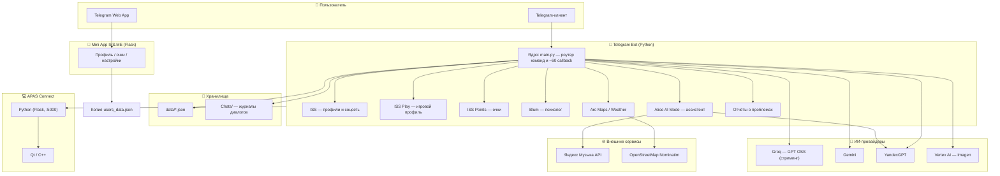
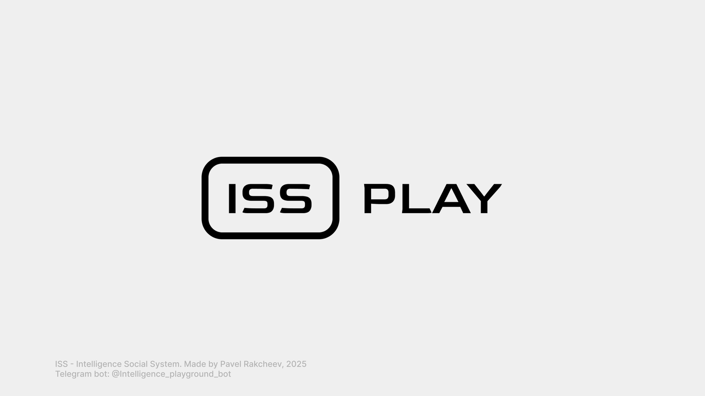
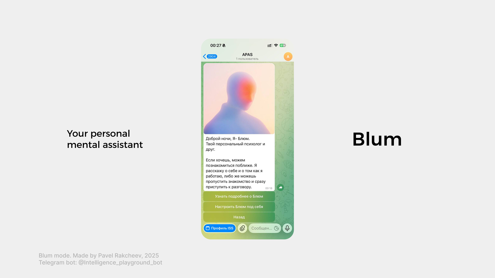
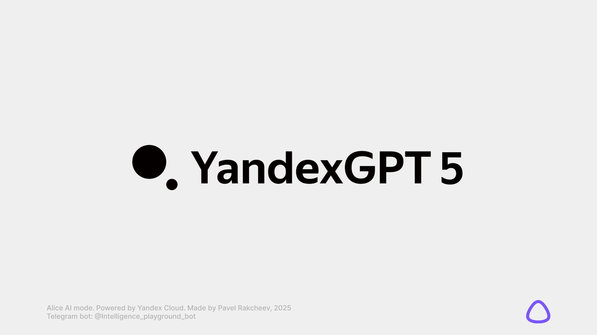
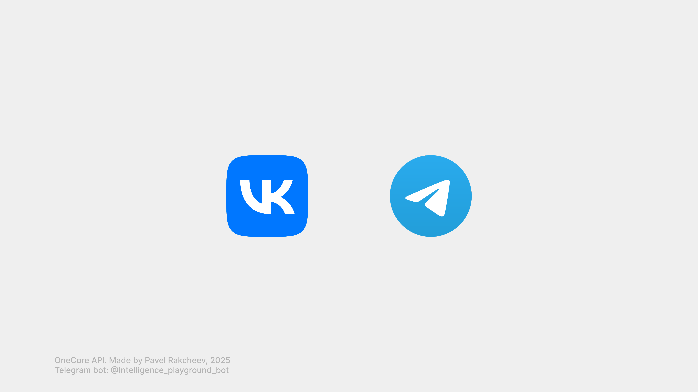
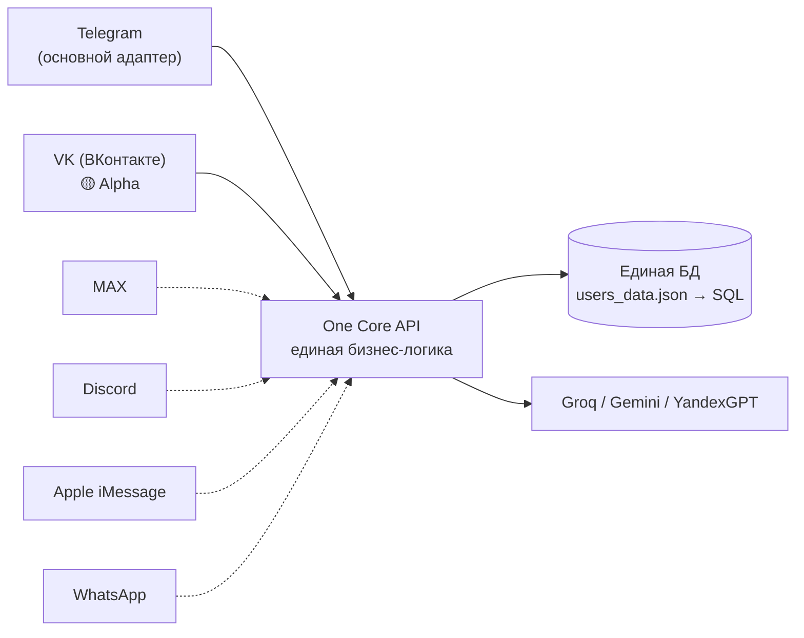
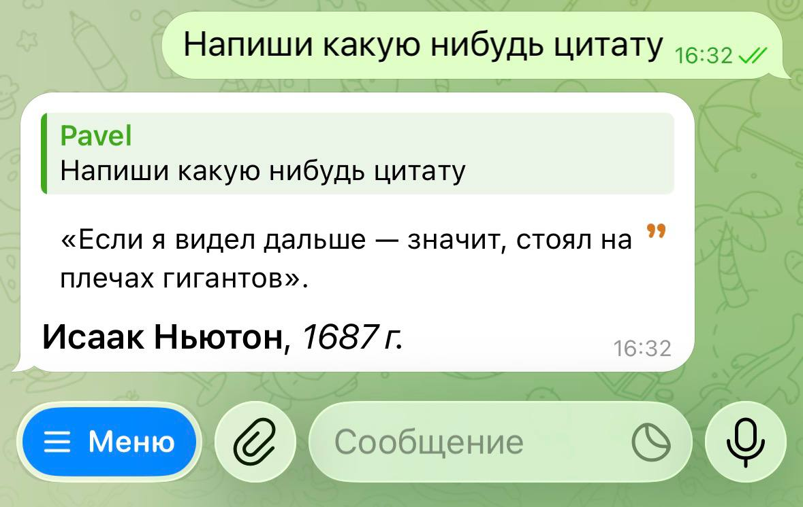
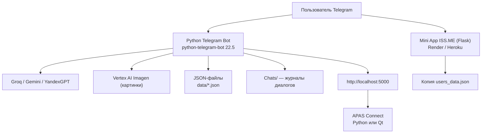
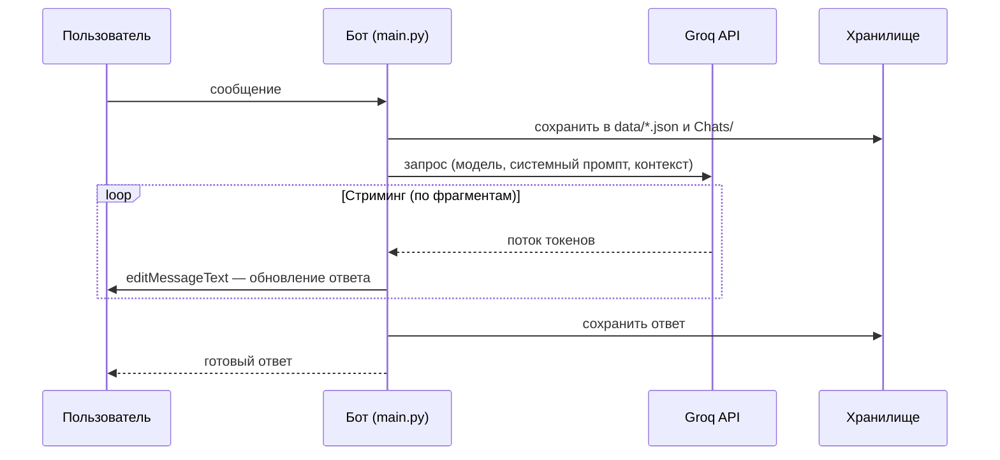

<p align="center">
  
</p>

<p align="center">
  
  
  
  
</p>

<p align="center">
  
  
  
  
  
  
  
  
</p>

<p align="center">
  
  
  
  
  
  
  
  
</p>

<br>

**APAS** (Адаптивная Аналитическая Предиктивная Система) — экспериментальная
экосистема вокруг Telegram-бота с мультимодельным ИИ. Проект объединяет
социальную платформу **ISS** (Intelligence Social System), игровую подсистему
**ISS Play**, валюту **ISS Points**, веб-профиль **ISS.ME**, режим
психологической поддержки **Blum**, ИИ-ассистента **Alice AI Mode** с
интеграцией Яндекс Музыки, мини-приложение, два десктопных
клиента-моста «APAS Connect» (Python и Qt/C++) и четыре интеграции
с ИИ-провайдерами.

> [!WARNING]
> ### ⚠️ CANARY RELEASE
>
> Это **первая публичная версия с открытым исходным кодом** (`0.1.0-canary`).
> Версия крайне нестабильная, содержит задокументированные баги, уязвимости и
> не предназначена для production-эксплуатации. Публикуется в ознакомительных,
> исследовательских и образовательных целях.
>
> **Обязательно ознакомьтесь с [известными проблемами](docs/KNOWN-ISSUES.md)
> и обоими [аудитами](#-аудиты-безопасности) перед запуском.**
>
> Секреты, обнаруженные при аудите, из репозитория исключены, но **токены,
> которые могли попасть в руки третьих лиц, рекомендуется отозвать и
> перевыпустить**.

---

## ⚡ Быстрый старт

Запуск Telegram-бота за 60 секунд (полная инструкция:
[docs/SETUP.md](docs/SETUP.md)):

```bash
git clone https://github.com/pavelrakcheev/APAS-Telegram-Bot.git
cd APAS-Telegram-Bot
python3 -m venv .venv && source .venv/bin/activate
cp .env.example .env            # впишите TELEGRAM_BOT_TOKEN и GROQ_API_KEY
pip install -r requirements.txt
python main.py
```

> [!TIP]
> Нужны только два ключа: токен бота от [@BotFather](https://t.me/BotFather)
> и `GROQ_API_KEY` от [console.groq.com](https://console.groq.com/). Остальные —
> опционально.

**Альтернативные способы запуска:**

```bash
# Через Makefile (создаёт venv, фильтрует битую строку requirements)
make setup && make run

# Через Docker (бот + Mini App одной командой)
cp .env.example .env        # впишите ключи
docker compose up -d --build
```

<div align="right"><a href="#-оглавление">⬆️ Наверх</a></div>

---

## 🤖 Попробовать бота

Живой бот экосистемы: [@Intelligence_playground_bot](https://t.me/Intelligence_playground_bot)

| Команда | Что покажет |
|---|---|
| `/start` | Регистрация аккаунта ISS |
| `/alice` | ИИ-ассистент с интеграцией Яндекс Музыки |
| `/blum` | «Персональный психолог» |
| `/games` | Игровой профиль ISS Play |

Веб-профиль (Mini App ISS.ME): [iss-app-for-telegram-bot.onrender.com](https://iss-app-for-telegram-bot.onrender.com)

<div align="right"><a href="#-оглавление">⬆️ Наверх</a></div>

---

## 📑 Оглавление

<table>
<tr>
<td valign="top" width="25%">

**🚀 Начало работы**
- [О проекте](#-о-проекте)
- [Быстрый старт](#-быстрый-старт)
- [Попробовать бота](#-попробовать-бота)
- [Экосистема в цифрах](#-экосистема-в-цифрах)
- [Возможности](#-возможности)
- [Команды бота](#-команды-бота)

</td>
<td valign="top" width="25%">

**🌐 Экосистема APAS**
- [Карта экосистемы](#-карта-экосистемы)
- [Зрелость компонентов](#-зрелость-компонентов)
- [ISS](#iss--intelligence-social-system)
- [ISS Play](#iss-play)
- [ISS Points](#iss-points)
- [ISS.ME](#issme)
- [Blum](#blum)
- [Alice AI Mode](#-alice-ai-mode)
- [One Core API](#-one-core-api--мультиплатформенное-ядро-будущего)

</td>
<td valign="top" width="25%">

**🛠 Технические детали**
- [Архитектура](#-архитектура)
- [Технологический стек](#-технологический-стек)
- [Структура проекта](#-структура-проекта)
- [Установка и запуск](#-установка-и-запуск)
- [API-ключи](#-api-ключи-что-для-чего-нужно)
- [Конфигурация](#-конфигурация)
- [ИИ-модели](#-ии-модели)
- [Хранение данных](#-хранение-данных)

</td>
<td valign="top" width="25%">

**🔒 Статус и планы**
- [Известные проблемы](#-известные-проблемы)
- [Аудиты безопасности](#-аудиты-безопасности)
- [Roadmap](#-roadmap)
- [Версионирование](#-версионирование)
- [FAQ](#-faq)
- [Лицензия и контакты](#-лицензия-и-контакты)

</td>
</tr>
</table>

<div align="right"><a href="#-оглавление">⬆️ Наверх</a></div>

---

## 🤖 О проекте

Проект задуман как «песочница» — экспериментальная площадка для проверки идей:
мультимодельный ИИ-ассистент в Telegram, социальная платформа с профилями и
очками, отчёты о проблемах, карты и погода, генерация изображений,
«персональный психолог» и генератор мини-приложений.

| Компонент | Технологии | Описание |
|---|---|---|
| **Telegram Bot** | Python, python-telegram-bot 22.5, Groq/Gemini/YandexGPT SDK | Основной компонент: ИИ-чат, ISS, профили, очки, отчёты, команды |
| **Mini App (ISS.ME)** | Flask 3.1.2, HTML5/CSS3/JS, Telegram WebApp SDK, gunicorn | Веб-профиль пользователя: очки, настройки, погода |
| **APAS Connect (Python)** | Flask, pystray, tkinter, psutil, PIL | Десктопный мост ПК↔бот: системная информация по HTTP API |
| **APAS Connect (Qt)** | Qt 6.9.3, C++17, MSVC, CMake, WinAPI | Ремейк моста для Windows |
| **ИИ-модули** | Groq SDK 0.33, google-generativeai 0.8.5, requests, vertexai | 18+ моделей трёх провайдеров + генерация изображений |

<div align="right"><a href="#-оглавление">⬆️ Наверх</a></div>

---

# 🌐 Экосистема APAS

Экосистема построена вокруг **ISS — Intelligence Social System**
(Интеллектуальная Социальная Система): единого аккаунта пользователя,
который используется всеми сервисами — от ИИ-чата до игр.

<div align="right"><a href="#-оглавление">⬆️ Наверх</a></div>

---

## 🗺 Карта экосистемы



<div align="right"><a href="#-оглавление">⬆️ Наверх</a></div>

---

## 📊 Зрелость компонентов (v0.1)

| Компонент | Реализовано | Заглушки / баги | Статус |
|---|---|---|---|
| **Telegram Bot (ядро)** | ИИ-чат, модели, стриминг, все команды | Часть ИИ-моделей отключена провайдерами | 🟡 Работает |
| **ISS** | Аккаунт, профили, поиск, статистика | «Написать сообщение», «Добавить в друзья» | 🟡 Работает |
| **ISS Play** | Регистрация, генерация никнеймов, привязка ISS | Достижения, рейтинг, игра | 🟡 Работает |
| **ISS Points** | Баланс, история, начисление админом | «Заработать больше» | 🟢 Работает |
| **ISS.ME (Mini App)** | Профиль, очки, настройки | `/api/debug` открыт, CORS, очки «60» | 🟠 Опасно |
| **Blum** | Приветствие, описание | Настройка, диалог | 🟡 Работает |
| **Alice AI Mode** | Диалог (Lite/Pro), Яндекс Музыка | Потеря состояния, нет воспроизведения | 🟡 Работает |
| **Arc Maps** | Места рядом, категории, такси | Погода — мок | 🟡 Работает |
| **APAS Connect (Python)** | API, трей, сборка exe | `tkinter` в requirements | 🟢 Работает |
| **APAS Connect (Qt)** | UI, мониторинг, трей | Порты, фризы (F10) | 🟠 Бета |
| **One Core API** | VK Alpha-тест | Telegram + VK (alpha) | 🟡 Alpha |

**Легенда:** 🟢 стабильно · 🟡 работает с оговорками · 🟠 требует внимания ·
🔴 не реализовано. Подробности каждого статуса — в
[KNOWN-ISSUES.md](docs/KNOWN-ISSUES.md).

<div align="right"><a href="#-оглавление">⬆️ Наверх</a></div>

---

## ISS — Intelligence Social System

<p align="center">
  
</p>

**ISS (Intelligence Social System)** — внутренняя социальная платформа проекта.
Пользователь получает единый аккаунт ISS при регистрации в боте
(команда `/start`) и может взаимодействовать с другими участниками.

### Что реализовано в коде v0.1

| Функция | Код | Статус |
|---|---|---|
| Единый аккаунт ISS (имя, возраст, город, username) | `Commands/start.py`, `shared.py`, `data/users_data.json` | ✅ Работает |
| Просмотр чужого профиля по ссылке `profile_<username>` | `Commands/profile.py` (`show_shared_profile`), deep-link в `/start` | ✅ Работает |
| Поиск пользователей по `@username` | `shared.py::find_user_id_by_username()` | ✅ Работает |
| Кнопка «Написать сообщение через APAS» (`message_user_`) | `Commands/profile.py:561` | ⚠️ Заглушка «будет реализовано в будущих обновлениях» |
| Кнопка «Добавить в друзья» (`add_friend_`) | `Commands/profile.py:106` | ⚠️ Заглушка |
| Статистика системы (`/iss`): кол-во пользователей, последний новый | `Commands/iss.py` | ✅ Работает |
| Уникальные username (занятость проверяется) | `shared.py::is_username_available()` | ✅ Работает |
| Гостевой режим без аккаунта | `Commands/guest.py` | ✅ Работает |

### Как это работает

1. Пользователь регистрируется: `/start` → простой (3 шага) или расширенный
   (5 шагов) онбординг.
2. Профиль хранится в `data/users_data.json` с ключом = Telegram ID.
3. Каждый пользователь может установить уникальный `username` — по нему
   другие находят его профиль (`/profile` → «Найти пользователя»).
4. Просмотр чужого профиля: `t.me/<bot>?start=profile_<username>` — открывает
   профиль с кнопками «Написать сообщение через APAS» и «Добавить в друзья»
   (в v0.1 — заглушки).

### Технологии ISS

  

Python 3, python-telegram-bot 22.5, JSON-хранилище (`data/users_data.json`),
inline-клавиатуры Telegram, deep-links.

<div align="right"><a href="#-оглавление">⬆️ Наверх</a></div>

---

## ISS Play

<p align="center">
  
</p>

**ISS Play** — игровая интеграция в ISS: игровой профиль по типу
Xbox Live / PlayStation, связанный с социальным аккаунтом.

### Что реализовано в коде v0.1 (`Commands/games.py`, 205 строк)

| Функция | Описание | Статус |
|---|---|---|
| Регистрация игрового профиля (3 этапа) | `games_register` → `games_register_start` → `games_finish_registration` | ✅ Работает |
| Генерация никнеймов ИИ | `shared.py::generate_iss_play_nicknames()` — 3 варианта через Groq `openai/gpt-oss-120b` по имени и username | ✅ Работает |
| Свой никнейм | Ручной ввод, валидация `^[a-zA-Z0-9]{5,}$`, проверка занятости | ✅ Работает |
| Связывание с аккаунтом ISS | `games_link_accounts` → `linked_to_iss = true`, никнейм в профиле | ✅ Работает |
| Кнопка «Мой ISS Play» в профиле | `Commands/profile.py:566` — никнейм, дата создания, статус связи | ✅ Работает |
| Достижения и рейтинг | «В разработке» | ⚠️ Заглушка |
| Игры | Заявлены «Крестики-Нолики» (`games_list`) | ⚠️ Не реализована |

### Данные

`data/iss_play_accounts.json`:
```json
{
  "user_id": {
    "nickname": "ИгровойНикнейм",
    "created_at": 1730000000,
    "linked_to_iss": true
  }
}
```

### Технологии ISS Play

  

Groq SDK (генерация никнеймов), JSON-хранилище, inline-клавиатуры,
regex-валидация.

<p align="center">
  
  &nbsp;&nbsp;&nbsp;&nbsp;
  
</p>
<p align="center"><sub>Профиль ISS Play и игровая подсистема</sub></p>

<div align="right"><a href="#-оглавление">⬆️ Наверх</a></div>

---

## ISS Points

<p align="center">
  
</p>

**ISS Points** — внутренняя валюта-очки системы ISS. Хранится в профиле
пользователя (`points`), начисляется администратором, отображается в боте
и в Mini App.

### Что реализовано в коде v0.1

| Функция | Код | Статус |
|---|---|---|
| Баланс в профиле | `Commands/points.py`, поле `points` в `users_data.json` | ✅ Работает |
| Команда `/points` | Баланс + меню: «Заработать больше», «История накоплений» | ✅ Работает |
| История транзакций с пагинацией (5 записей/стр.) | `Commands/points.py::show_points_history()` — дата, имя и @username админа, сумма | ✅ Работает |
| Начисление администратором | `Commands/addpoints.py` (`/addpoints`): топ-5 активных юзеров или поиск по @username | ✅ Работает |
| Журнал начислений | `data/points_transactions.json` (timestamp, amount, admin) | ✅ Работает |
| Уведомление получателю | При начислении | ✅ Работает |
| «Заработать больше» | Ежедневные задания, общение, посты, акции | ⚠️ Заглушка «в разработке» |
| Отображение в Mini App | `Mini App/points.html` | ⚠️ Захардкожено «60» |
| Кнопка «Посмотреть очки» в профиле | `Commands/profile.py` (`view_points`) | ✅ Работает |

### Как начисляются очки (код)

`Commands/addpoints.py`:
1. Админ вызывает `/addpoints`.
2. Выбор получателя: кнопки с топ-5 по балансу или ручной ввод `@username`.
3. Ввод суммы → запись транзакции в `points_transactions.json` →
   обновление `points` в профиле → уведомление получателю.

### Технологии ISS Points

  

Python, python-telegram-bot 22.5, JSON-хранилища (`users_data.json`,
`points_transactions.json`), inline-клавиатуры, пагинация.

<p align="center">
  <video src="docs/media/videos/ISS%20Points%20%2B%20Mini%20App%20review.mp4" controls width="500"></video>
</p>
<p align="center"><sub>Обзор ISS Points и Mini App ISS.ME</sub></p>

<div align="right"><a href="#-оглавление">⬆️ Наверх</a></div>

---

## ISS.ME

<p align="center">
  
</p>

**ISS.ME** — веб-профиль ISS: Telegram Mini App (Web App), которое открывается
кнопкой в боте. Домен `iss.me` в кодовой базе не встречается — в v0.1
приложение хостится на Render (`https://iss-app-for-telegram-bot.onrender.com`).

### Что умеет Mini App (код: `Mini App/`, Flask 3.1.2)

| Страница | Функции | Статус |
|---|---|---|
| `index.html` | Логотип ISS, имя и username, блок очков, блок погоды, город и дата регистрации, кнопки «Редактировать» и «Поделиться профилем» | ✅ Работает (с багами, см. Known Issues) |
| `points.html` | Страница очков | ⚠️ Заглушка «в разработке» |
| `settings.html` | 4 тумблера: стриминг + уведомления (обновления, изменения, промо) | ✅ Работает |

### API (код: `Mini App/app.py`)

| Метод | Путь | Функция |
|---|---|---|
| GET | `/api/user-profile?user_id=` | Профиль: имя, username, возраст, город, дата регистрации, статистика репортов |
| GET | `/api/weather` | Погода (мок, координаты Москвы захардкожены) |
| GET | `/api/user-settings?user_id=` | Настройки пользователя |
| POST | `/api/user-settings` | Сохранение настроек |
| GET | `/api/debug` | Отладочная информация ⚠️ (уязвимость v0.1, см. Known Issues) |

### Технологии ISS.ME

     

Flask 3.1.2, HTML5, CSS3, JavaScript, Telegram WebApp SDK, SVG-иконки,
gunicorn, Render/Heroku (Procfile, runtime.txt python-3.11.6).

<div align="right"><a href="#-оглавление">⬆️ Наверх</a></div>

---

## Blum

<p align="center">
  
</p>

**Blum** — режим ментально-психологической поддержки: «персональный психолог
и друг», настроенный на конфиденциальное общение на личные темы.

### Что реализовано в коде v0.1 (`Commands/blum.py`, 100 строк)

| Функция | Описание | Статус |
|---|---|---|
| Команда `/blum` | Приветствие Блюма (по времени суток: утро/день/вечер/ночь) + фото `src/blum.jpg` | ✅ Работает |
| «Узнать подробнее о Блюм» | Рассказ о себе: настроенная языковая модель, конфиденциальность, хранение важных фактов | ✅ Работает |
| «Настроить Блюм под себя» | — | ⚠️ Заглушка («будет реализовано в ближайшее время») |
| «Начать диалог» | Приглашение рассказать о проблемах | ⚠️ Баг: показывает чужой текст заглушки |
| Приватность | В интерфейсе заявлено шифрование и несохранение диалогов | ❌ Не соответствует коду: диалоги пишутся в `Chats/` (см. Known Issues) |

### Как это работает (код)

1. `/blum` → проверка гостевого режима → приветствие
   (`get_blum_greeting()` по `datetime.now().hour`) + фото.
2. Inline-кнопки: `blum_about` (описание), `blum_settings` (заглушка),
   `blum_back` / `blum_main` (навигация).

### Технологии Blum

 

Python, python-telegram-bot 22.5, inline-клавиатуры, фотографии
(`src/blum.jpg`), time-based приветствия.

<div align="right"><a href="#-оглавление">⬆️ Наверх</a></div>

---

## 🤖 Alice AI Mode

<p align="center">
  
</p>

**Alice AI Mode** — режим ИИ-ассистента в духе виртуального помощника Яндекса:
отдельная «вселенная» внутри бота со своим системным промптом, двумя моделями
YandexGPT и интеграцией Яндекс Музыки. Активируется командой `/alice`,
работает независимо от обычного ИИ-чата APAS.

### Что реализовано в коде v0.1 (`Modes/Alice/alice.py`, 376 строк)

| Функция | Код | Статус |
|---|---|---|
| Команда `/alice` | Фото `Modes/Alice/src/Alice.png` + описание + inline-кнопки «Перейти в режим Алисы» / «Назад» | ✅ Работает |
| Вход в режим (`alice_enter`) | Reply-клавиатура, состояние `{active, model, conversation}` | ✅ Работает |
| ИИ-диалог | `process_alice_ai_response()` — YandexGPT с системным промптом | ✅ Работает |
| История диалога (последние 10 сообщений) | `conversation` в `data/alice_states.json` | ✅ Работает (с багом после рестарта, см. Known Issues) |
| Переключение модели | Кнопка «Переключить на Алису Про/Lite» (`switch_alice_model`) | ✅ Работает |
| Выход из режима | `/exit` или кнопка «Выйти из режима» | ✅ Работает |
| Музыкальные команды | `/music`, `/yamusic`, запросы на естественном языке | ✅ Работает |
| Команды режима | `/commands`, `/modes` | ✅ Работает |
| Реальное воспроизведение музыки | «Включи мою волну», «стоп» | ⚠️ Воспроизведения нет — только информация о треках |
| Персональные станции «Моя волна» | Без OAuth-токена пользователя | ⚠️ Fallback на чарты |

### Два режима модели

| Режим | Модель (`Models/yandex.py`) | Назначение |
|---|---|---|
| **Алиса Lite** | YandexGPT 5 Lite (`yandexgpt-5-lite`) | Повседневные запросы, быстрые и экономичные ответы |
| **Алиса Про** | YandexGPT 5.1 Pro (`yandexgpt-5.1`) | Сложные задачи, глубокий анализ, детальные ответы |

Переключение — кнопкой в reply-клавиатуре. Системный промпт
`ALICE_SYSTEM_PROMPT` задаёт роль ассистента: русский язык, дружелюбный
профессиональный тон, структурированные ответы в Markdown, этические
ограничения, сохранение контекста диалога.

### 🎵 Интеграция с Яндекс Музыкой

`Modes/Alice/Commands/yamusic.py` (461 строка) — интеграция через
официальную библиотеку `yandex-music` 2.1.0. Музыкальный запрос
распознаётся автоматически по ключевым словам («включи», «найди»,
«поищи», «играй», «музыка», «трек», «песня», «волна»...) и не попадает
в обычный ИИ-чат.

| Запрос | Действие | Код |
|---|---|---|
| «Включи мою волну» | Персональные рекомендации через станцию «Моя волна» (rotor); fallback — чарты | `get_my_wave()` |
| «Включи / найди [трек или артист]» | Поиск треков `client.search(type_='track')`, до 10 результатов | `search_tracks()` |
| «Какая последняя песня я добавил» | Лайкнутые треки, отсортированные по дате | `get_recently_added_tracks()` |
| «Что играет» / «стоп» | Служебные ответы (воспроизведения нет) | — |
| Популярное | Топ-чарты Яндекс Музыки | `get_popular_tracks()` |
| Плейлисты | Список плейлистов пользователя и их треки (нужна авторизация) | `get_user_playlists()`, `get_playlist_tracks()` |

**Авторизация:** персональные токены пользователей хранятся в
`data/yandex_music_tokens.json`; токен администратора —
`YANDEX_MUSIC_ADMIN_TOKEN` из `.env`; без токена используется анонимный
клиент (поиск работает, персональные станции — нет). При ошибках API
возвращаются тестовые треки-заглушки.

### Как это работает

1. `/alice` → фото `Alice.png` + inline-кнопка «Перейти в режим Алисы».
2. `alice_enter` → состояние сохраняется в `data/alice_states.json`,
   включается reply-клавиатура («Выйти из режима», «Переключить на Алису...»).
3. Каждое сообщение: проверка `music_keywords` → музыкальный запрос уходит
   в Яндекс Музыку, обычный — в YandexGPT с историей последних 10 сообщений.
4. Выход: `/exit` или кнопка → состояние удаляется, клавиатура убирается.

### Технологии Alice AI Mode

   

Python, python-telegram-bot 22.5, YandexGPT (Yandex Cloud Foundation Models
API через `requests`, `Api-Key`-авторизация), `yandex-music` 2.1.0,
JSON-хранилища (`alice_states.json`, `yandex_music_tokens.json`),
reply/inline-клавиатуры, Markdown-форматирование, фото (`Modes/Alice/src/Alice.png`).

### Известные проблемы v0.1

- **Потеря состояния после рестарта бота** — ключи `user_id` сохраняются в
  JSON строками, а поиск идёт по `int` (см. [Known Issues F11](docs/KNOWN-ISSUES.md)).
- **Нет реального воспроизведения** — бот показывает информацию о треках,
  но не проигрывает их.
- **«Моя волна»** без персонального OAuth-токена возвращает чарты.
- **Дублирование кода** — `Modes/Alice/Commands/{commands,exit,modes}.py`
  дублируют обработчики из `alice.py`; старый `Modes/Alice/yamusic.py`
  (requests-версия) не используется.

<p align="center">
  <video src="docs/media/videos/Alice%20AI%20mode.mp4" controls width="500"></video>
</p>
<p align="center"><sub>Демонстрация Alice AI Mode с Яндекс Музыкой</sub></p>

<div align="right"><a href="#-оглавление">⬆️ Наверх</a></div>

---

## 🔌 One Core API — мультиплатформенное ядро

<p align="center">
  
</p>

> [!NOTE]
> **Alpha-тест VK-интеграции завершён.** Бот работает в VK с полным набором
> команд (см. [скриншот](docs/media/images/APAS%20on%20VK%20(alpha%20test).jpg)).
> В кодовой базе v0.1 реализована начальная поддержка VK через
> `python-vk-api`. Одна бизнес-логика, разные мессенджеры.

**One Core API** — «единое ядро»: один бэкенд, одна база данных,
одна бизнес-логика, а поверх — адаптеры для разных мессенджеров.
На данный момент реализованы:

| Мессенджер | Статус | Описание |
|---|---|---|
| **Telegram** | ✅ Основной | Полная реализация (текущий код) |
| **VK (ВКонтакте)** | 🟡 Alpha | Тестовая интеграция, основные команды |
| **MAX** | 🔴 Планируется | Концепция |
| **Discord** | 🔴 Планируется | Концепция |
| **iMessage** | 🔴 Планируется | Концепция |
| **WhatsApp** | 🔴 Планируется | Концепция |

### Как реализована текущая версия



<p align="center">
  
</p>
<p align="center"><sub>APAS в VK — alpha-тест: бот работает с полным набором команд</sub></p>

### Что реализовано в коде v0.1

- **Telegram** — полная реализация: все команды, callback-кнопки, inline-режим.
- **VK** — alpha-интеграция: бот работает в VK с теми же командами
  (подтверждено скриншотами и видео).
- **Вся бизнес-логика** (`Commands/`, `shared.py`, `data/`) — переиспользуется
  для обоих мессенджеров.
- **ИИ-слой** (`Models/`, `generate_ai_response`) — полностью независим
  от мессенджера.
- **Данные** (`data/*.json`) — единое хранилище для Telegram и VK пользователей.

### План развития

1. ✅ ~~Реализовать VK-адаптер~~ (выполнено — alpha-тест)
2. Выделить транспортный интерфейс: `Message`, `Callback`, `Command`
3. Реализовать адаптеры: MAX, Discord, iMessage, WhatsApp
4. Заменить JSON на SQL-базу с единой схемой
5. Единая авторизация: `user_id` → единый аккаунт ISS во всех мессенджерах

### Технологии

    

Python 3, asyncio, python-vk-api (VK), discord.py,
imessage API, WhatsApp Business API, SQLite/PostgreSQL.

<div align="right"><a href="#-оглавление">⬆️ Наверх</a></div>

---

## ✨ Возможности

### ИИ-общение

- **Мультимодельный агрегатор** — выбор из 18+ моделей трёх провайдеров
  через команду `/models`: Groq (GPT OSS, Qwen, Llama, Kimi), Gemini 2.0/2.5,
  YandexGPT 4/5/5.1.
- **Потоковая генерация** (`streaming`) в реальном времени для моделей Groq —
  ответ редактируется по мере генерации. Режим настраивается в `/settings`.
- **Персонализация** — динамический системный промпт с именем, возрастом и
  городом пользователя.
- **Кнопка «Повторить»** при ошибке генерации и «Сообщить об ошибке».
- **Поддержка HTML-разметки** в ответах (жирный, курсив, моноширинный,
  цитаты, спойлеры).
- **Журнал диалогов** — каждая беседа сохраняется в `Chats/<user_id>/chat.txt`.

<p align="center">
  
  &nbsp;&nbsp;&nbsp;&nbsp;
  
</p>
<p align="center"><sub>Выбор ИИ-модели и потоковая генерация ответа</sub></p>

<p align="center">
  
  &nbsp;&nbsp;&nbsp;&nbsp;
  
</p>
<p align="center"><sub>Поддержка Markdown и голосовой ввод</sub></p>

<p align="center">
  <video src="docs/media/videos/Choose%20models.mp4" controls width="400"></video>
  &nbsp;&nbsp;&nbsp;&nbsp;
  <video src="docs/media/videos/Fast%20streaming.mp4" controls width="400"></video>
</p>
<p align="center"><sub>Выбор моделей и быстрый стриминг</sub></p>

### ISS: пользователи, профили, соцсеть

- **Онбординг в два режима**: простой (3 шага: имя + уведомления) и расширенный
  (5 шагов: имя, возраст, город, уведомления).
- **Гостевой режим** — вход без регистрации с ограничением команд.
- **Профиль** (`/profile`): имя, возраст, город, username; редактирование
  инлайн-кнопками, шаринг профиля по ссылке, «удаление» аккаунта.
- **Просмотр чужих профилей** по `start=profile_<username>`, кнопки
  «Написать через APAS» и «Добавить в друзья».
- **ISS Points** (`/points`): баланс, история транзакций с пагинацией,
  начисление администратором (`/addpoints`).
- **Уведомления** (`/notifications`): обновления, изменения, промо-рассылки.

### Отчёты о проблемах

- **Подача отчёта** (`/report`) с категориями (генерация текста, профиль,
  карты, погода, другое) и статусами.
- **Мои отчёты** (`/myreports`) — просмотр по статусам.
- **Админ-панель** (`/reports`) — фильтры, пагинация, смена статусов, архив.

### Геосервисы

- **Arc Maps** (`/maps`, геолокация): места рядом (OpenStreetMap Nominatim)
  по категориям (магазины, еда, достопримечательности, медицина, финансы),
  настройка категорий и расстояния, кнопка «Такси» (ссылка Яндекс.Go),
  определение города по координатам.
- **Arc Weather** (кнопка «Погода» в картах и в Mini App): прогноз.

> [!WARNING]
> В текущей версии погода — **заглушка** (моковые данные).

<p align="center">
  
  &nbsp;&nbsp;&nbsp;&nbsp;
  <video src="docs/media/videos/Arc%20maps%20settings.mp4" controls width="350"></video>
</p>
<p align="center"><sub>Arc Maps — поиск мест и настройка категорий</sub></p>

### Развлечения и сервисы

- **ISS Play** (`/games`) — «лаунчер» игр: регистрация игрового профиля с
  генерацией никнеймов через Groq и привязкой аккаунта ISS.
- **Blum** (`/blum`) — «персональный психолог» с приветствием по времени суток.
- **Режим «Алисы»** (`/alice`) — ИИ-ассистент на YandexGPT (Lite/Pro) с
  интеграцией Яндекс Музыки: поиск треков, «Моя волна», чарты, плейлисты
  (см. [Alice AI Mode](#-alice-ai-mode)).
- **Генерация изображений** (`/image`) — Imagen 3.0 через Google Vertex AI.

> [!WARNING]
> В v0.1 команда **не зарегистрирована** в обработчиках бота (см.
> [известные проблемы](docs/KNOWN-ISSUES.md)).

### Администрирование

- `/tools` — системные операции: очистка `__pycache__`, компиляция кода,
  остановка бота (требует секретную фразу).
- `/createpost` — создание поста и массовая рассылка по категориям и
  подпискам (критические — всем пользователям).
- `/addpoints` — начисление ISS Points с выбором получателя.
- `/reports` — панель управления отчётами.
- `/remote` — системная информация с ПК через локальный APAS Connect.

### Прочее

- `/commands` — справка по всем командам.
- `/about` — информация о системе.
- `/iss` — статистика ISS (зарегистрированные пользователи).
- `/acc_stat` — статус учётной записи и права доступа.
- `/start`, `/signup`, `/guest` — регистрация и гостевой вход.
- `/settings` — переключение потоковой генерации.

<div align="right"><a href="#-оглавление">⬆️ Наверх</a></div>

---

## 💬 Команды бота

| Команда | Доступ | Описание |
|---|---|---|
| `/start` | Все | Регистрация (простая/расширенная) или приветствие |
| `/guest` | Все | Войти в гостевом режиме |
| `/signup` | Гости | Перейти к регистрации |
| `/commands` | Все | Список команд |
| `/about` | Все | О системе APAS |
| `/profile` | Пользователи | Профиль ISS: просмотр, редактирование, шаринг |
| `/points` | Пользователи | ISS Points: баланс и история |
| `/models` | Пользователи | Выбор ИИ-модели |
| `/settings` | Пользователи | Настройки (потоковая генерация) |
| `/notifications` | Пользователи | Подписка на рассылки |
| `/report` | Пользователи | Подать отчёт о проблеме |
| `/myreports` | Пользователи | Мои отчёты |
| `/games` | Пользователи | ISS Play: игровой профиль |
| `/blum` | Пользователи | Режим психологической поддержки |
| `/alice` | Пользователи | Режим ИИ-ассистента (ЯндексGPT + Музыка) |
| `/acc_stat` | Пользователи | Статус учётной записи |
| `/iss` | Пользователи | Статистика ISS |
| `/remote` | Все ⚠️ | Информация о ПК через APAS Connect |
| `/reports` | Админ | Панель отчётов |
| `/addpoints` | Админ | Начисление ISS Points |
| `/createpost` | Админ | Создание и рассылка постов |
| `/tools` | Админ | Системные операции |

<div align="right"><a href="#-оглавление">⬆️ Наверх</a></div>

---

## 📈 Экосистема в цифрах

| Показатель | Значение |
|---|---|
| Модулей команд в боте | 22 |
| Строк Python-кода | ~9 089 |
| в т.ч. `Commands/` | ~5 200 |
| ИИ-моделей | 18+ (Groq / Gemini / YandexGPT) |
| ИИ-провайдеров | 3 + Vertex AI (Imagen) |
| Типов callback-кнопок | ~60 |
| Подсистем экосистемы | 11 (см. [карту](#-карта-экосистемы)) |
| JSON-хранилищ | 5 + журналы `Chats/` |
| Файлов в первом релизе | 96 |
| Мусора удалено при подготовке v0.1 | 663 МБ → 36 МБ |
| Задокументированных проблем | 26 (S1–S8, F1–F12, A1–A6) |

<div align="right"><a href="#-оглавление">⬆️ Наверх</a></div>

---

## 🏗 Архитектура



### Поток сообщения через стриминг (Groq)



### Ключевые архитектурные особенности

- **Единая точка маршрутизации** — все callback-кнопки обрабатываются в
  `main.py` (`button_callback`): около 60 типов callback-данных.
- **Хранилище — JSON-файлы** без БД: `users_data.json`, `points_transactions.json`,
  `reports.json`, `iss_play_accounts.json`, `alice_states.json`.
- **Мультипровайдерный ИИ** — модули `Models/groq.py`, `Models/gemini.py`,
  `Models/yandex.py` с единой точкой диспетчеризации `generate_ai_response()`.
- **Потоковая генерация** — только для Groq: асинхронная очередь
  `asyncio.Queue` + `run_in_executor`, сообщение редактируется по фрагментам.
- **Несколько копий данных** — Mini App работает со своей (устаревшей) копией
  `users_data.json`, что является задокументированным ограничением v0.1.

<div align="right"><a href="#-оглавление">⬆️ Наверх</a></div>

---

## 🛠 Технологический стек

### Бэкенд и бот

| Технология | Версия | Назначение |
|---|---|---|
| Python | 3.7+ (практически 3.10+) | Основной язык |
| python-telegram-bot | 22.5 | Telegram Bot API (async) |
| Groq SDK | 0.33.0 | ИИ: GPT OSS, Qwen, Llama, Kimi (со стримингом) |
| google-generativeai | 0.8.5 | Gemini 2.0/2.5 ⚠️ deprecated, EOL 30.11.2025 |
| google-cloud-aiplatform / vertexai | — | Imagen 3.0 ⚠️ генеративные модули удалены после 24.06.2026 |
| requests | 2.33.0 | HTTP-клиент (YandexGPT, API) |
| python-dotenv | 1.2.2 | Загрузка `.env` |
| yandex-music | 2.1.0 | Яндекс Музыка (режим «Алисы») |
| Pillow | 12.3.0 | Изображения, иконки |

### Mini App (ISS.ME)

| Технология | Версия | Назначение |
|---|---|---|
| Flask | 3.1.2 | Backend API |
| flask-cors | — | CORS ⚠️ открыт для всех доменов в v0.1 |
| gunicorn | — | Production-сервер (Procfile) |
| HTML5 / CSS3 / JavaScript | — | Frontend (3 страницы) |
| Telegram WebApp SDK | — | Интеграция с Telegram |
| SVG | — | Иконки ISS |
| Python | 3.11.6 | runtime.txt (Render) |

### Геосервисы

| Технология | Назначение |
|---|---|
| OpenStreetMap Nominatim | Геокодинг и места рядом (бесплатный API) |
| Groq | Анализ геолокации (стриминг) |

### APAS Connect (Python)

| Технология | Назначение |
|---|---|
| Flask | HTTP API (`/system_info`, `/ping`) |
| psutil | Системные метрики (CPU, RAM, диск, батарея) |
| pystray | Трей-иконка |
| tkinter | GUI-окна |
| PIL (Pillow) | Программная генерация иконок |
| PyInstaller | Сборка `APAS_Connect.exe` |
| winreg | Определение темы Windows |

### APAS Connect (Qt)

| Технология | Версия | Назначение |
|---|---|---|
| Qt | 6.9.3 | Widgets + Network |
| C++ | C++17 | Язык |
| MSVC | 2022 | Компилятор (Windows x64) |
| CMake | — | Сборка |
| WinAPI | — | GetSystemTimes, GlobalMemoryStatusEx, GetDiskFreeSpaceEx, GetTickCount64 |

<div align="right"><a href="#-оглавление">⬆️ Наверх</a></div>

---

## 📁 Структура проекта

```
Bot/
├── main.py                 # Точка входа бота: роутер команд и callback
├── shared.py               # Общие утилиты: users_data, admin, ISS Play, промпты
├── requirements.txt        # Зависимости бота
├── .env.example            # Шаблон конфигурации (скопировать в .env)
├── .gitignore
├── .dockerignore
├── Dockerfile              # Сборка бота (python:3.12-slim)
├── docker-compose.yml      # bot + mini-app одной командой
├── Makefile                # setup / run / test / check / docker-up
├── LICENSE                 # MIT
├── CHANGELOG.md            # История версий
├── README.md
├── SECURITY.md             # Политика безопасности
├── CONTRIBUTING.md         # Как контрибьютить
├── tests/
│   └── smoke_test.py       # Структурный smoke-тест (без сети и ключей)
├── assets/
│   ├── covers/             # Обложки экосистемы (ISS, Play, Points, ISS.ME, Blum, Alice, One Core)
│   └── logos/              # SVG-логотипы провайдеров и инструментов
├── .github/
│   ├── workflows/
│   │   ├── ci.yml          # CI: gitleaks, forbidden files, syntax, pip-audit, links
│   │   └── pages.yml       # GitHub Pages для docs/
│   ├── dependabot.yml      # Авто-обновления зависимостей
│   ├── ISSUE_TEMPLATE/     # Шаблоны Issues (баг, идея)
│   └── PULL_REQUEST_TEMPLATE.md
├── docs/                   # Документация и аудиты
│   ├── ARCHITECTURE.md
│   ├── SETUP.md            # Пошаговая инструкция по установке
│   ├── AUDIT-01-deepseek.md
│   ├── AUDIT-02-codex.md
│   └── KNOWN-ISSUES.md
├── Commands/               # 22 модуля команд бота (~5 200 строк)
│   ├── about.py            #   /about
│   ├── acc_stat.py         #   /acc_stat
│   ├── addpoints.py        #   /addpoints (админ, ISS Points)
│   ├── blum.py             #   /blum (психолог)
│   ├── commands.py         #   /commands
│   ├── createpost.py       #   /createpost (админ, рассылка)
│   ├── games.py            #   /games (ISS Play)
│   ├── generator.py        #   генератор мини-приложений ⚠️ не подключён
│   ├── guest.py            #   /guest, /signup
│   ├── image.py            #   /image (Imagen) ⚠️ не зарегистрирована
│   ├── iss.py              #   /iss (статистика ISS)
│   ├── models.py           #   /models (агрегатор ИИ)
│   ├── myreports.py        #   /myreports
│   ├── notifications.py    #   /notifications
│   ├── points.py           #   /points (ISS Points)
│   ├── profile.py          #   /profile (профиль ISS, соц. кнопки)
│   ├── remote.py           #   /remote (APAS Connect)
│   ├── report.py           #   /report
│   ├── reports.py          #   /reports (админ)
│   ├── settings.py         #   /settings
│   ├── start.py            #   /start (онбординг, deep-link профилей)
│   └── tools.py            #   /tools (админ)
├── Models/                 # ИИ-провайдеры
│   ├── groq.py             #   Groq (8 моделей, стриминг)
│   ├── gemini.py           #   Gemini (6 моделей)
│   ├── yandex.py           #   YandexGPT (4 модели)
│   └── src/                #   Логотипы моделей
├── Modes/
│   └── Alice/               # Alice AI Mode (YandexGPT + Яндекс Музыка)
│       ├── alice.py         # Режим «Алисы»: диалог, 2 модели, состояние
│       ├── yamusic.py       # ⚠️ старая версия (не используется)
│       ├── src/Alice.png    # Фото для /alice
│       └── Commands/
│           ├── yamusic.py   # Актуальная интеграция Яндекс Музыки (461 строка)
│           ├── commands.py  # ⚠️ дубль обработчиков из alice.py
│           ├── exit.py      # ⚠️ дубль обработчиков из alice.py
│           └── modes.py     # ⚠️ дубль обработчиков из alice.py
├── Modules/
│   ├── arc_maps.py         # Карты: Nominatim, категории, такси (730 строк)
│   └── arc_weather.py      # Погода ⚠️ мок-заглушка
├── Mini App/               # ISS.ME — Telegram Web App (Flask)
│   ├── app.py              # API: профиль, погода, настройки
│   ├── index.html          # Страница профиля
│   ├── points.html         # Страница очков
│   ├── settings.html       # Страница настроек
│   ├── styles.css
│   ├── Procfile / runtime.txt / requirements.txt
│   └── src/                # SVG-иконки
├── data/                   # JSON-хранилища (не публикуются)
├── Chats/                  # Журналы диалогов (не публикуются)
├── src/
│   ├── config.py           # Загрузка .env
│   └── blum.jpg            # Фото для /blum
├── APAS Connect/           # Python-мост ПК↔бот
│   ├── main.py             # Flask API + трей + tkinter
│   ├── main_old.py         # ⚠️ старая версия
│   ├── build_exe.py        # PyInstaller-сборка
│   ├── APAS_Connect.spec
│   ├── config.example.json # Шаблон конфигурации
│   ├── test_api.py         # Тест API
│   └── src/                # Иконки
└── APAS Connect Qt/        # Qt/C++ ремейк
    ├── CMakeLists.txt
    ├── main.cpp
    ├── MainWindow.cpp/.h
    ├── HttpServer.cpp/.h
    ├── SystemMonitor.cpp/.h
    └── TrayIcon.cpp/.h
```

<div align="right"><a href="#-оглавление">⬆️ Наверх</a></div>

---

# 🚀 Установка и запуск

> [!NOTE]
> Полная пошаговая инструкция: [docs/SETUP.md](docs/SETUP.md).

## 1. 🐍 Telegram-бот

### Требования

- **Python 3.10+** (рекомендуется 3.12/3.13; README оригинального проекта
  заявляет 3.7+, но текущие зависимости требуют новее)
- **Токен Telegram-бота** от [@BotFather](https://t.me/BotFather) — обязателен
- **GROQ_API_KEY** от [console.groq.com](https://console.groq.com/) —
  обязателен (основной ИИ-провайдер)
- Остальные ключи — опционально (см. [API-ключи](#-api-ключи-что-для-чего-нужно))

### Установка

```bash
# 1. Клонировать репозиторий
git clone https://github.com/pavelrakcheev/APAS-Telegram-Bot.git
cd APAS-Telegram-Bot

# 2. Создать виртуальное окружение
python3 -m venv .venv
source .venv/bin/activate        # macOS/Linux
.venv\Scripts\activate           # Windows

# 3. Установить зависимости
pip install -r requirements.txt

# 4. Создать конфигурацию из шаблона
cp .env.example .env
#    ... и заполнить своими ключами
```

### Конфигурация `.env`

```bash
# Минимум для запуска (проверяется в src/config.py):
TELEGRAM_BOT_TOKEN=ваш_токен_от_botfather
GROQ_API_KEY=ваш_ключ_groq

# Опционально:
TELEGRAM_ID=ваш_telegram_id        # администрирование бота
ADMIN_PASSWORD=пароль_админа       # /tools, критические посты
GEMINI_API_KEY=...                 # модели Gemini
GOOGLE_CLOUD_PROJECT=...           # генерация изображений
GOOGLE_CLOUD_LOCATION=us-central1
YANDEX_API_KEY=...                 # YandexGPT
YANDEX_MUSIC_ADMIN_TOKEN=...       # Яндекс Музыка (режим «Алисы»)
```

### Запуск

```bash
python main.py
```

Бот стартует в режиме long-polling (`run_polling()`), лог в консоли.

### Проверка работы

1. Откройте чат с ботом в Telegram.
2. Отправьте `/start` — начнётся регистрация (простая/расширенная).
3. После регистрации отправьте любое сообщение — бот ответит через Groq
   (модель по умолчанию `openai/gpt-oss-120b`).

> [!WARNING]
> `requirements.txt` содержит битую строку `google-cloud-aiplatform-`
> без версии (известная проблема v0.1) — при ошибке установки поставьте
> её явно: `pip install "google-cloud-aiplatform>=1.90"`.

<div align="right"><a href="#-оглавление">⬆️ Наверх</a></div>

---

## 2. 📱 Mini App (ISS.ME)

### Требования

- Python 3.11+ (в деплое — 3.11.6, `runtime.txt`)
- HTTPS-домен (обязательное требование Telegram для Web Apps)
- Файл `users_data.json` с данными пользователей (копия из `data/` бота)

### Локальный запуск

```bash
cd "Mini App"

# 1. Виртуальное окружение
python3 -m venv .venv
source .venv/bin/activate

# 2. Зависимости
pip install -r requirements.txt

# 3. Скопировать данные пользователей из бота
cp ../data/users_data.json users_data.json

# 4. Запуск (development)
python app.py          # Flask dev-сервер
```

Приложение будет доступно на `http://localhost:5000` (порт из `app.py`).

### Деплой на Render.com (рекомендуется)

1. Создайте аккаунт на [render.com](https://render.com).
2. Загрузите папку `Mini App/` в свой GitHub-репозиторий (или в этот).
3. **New Web Service** → выберите репозиторий:
   - **Environment:** Python 3
   - **Build Command:** `pip install -r requirements.txt`
   - **Start Command:** `gunicorn app:app`
4. Получите URL вида `https://your-app.onrender.com`.
5. В боте (`Commands/profile.py`) укажите URL в кнопке WebApp:

```python
from telegram import InlineKeyboardButton, WebAppInfo
keyboard = [[InlineKeyboardButton("👤 Мой профиль",
    web_app=WebAppInfo(url="https://your-app.onrender.com"))]]
```

### Деплой на Heroku

В папке уже есть `Procfile` (`web: gunicorn app:app`) и `runtime.txt`
(python-3.11.6):

```bash
cd "Mini App"
heroku create iss-me
git init && git add . && git commit -m "ISS.ME"
git push heroku main
```

> [!CAUTION]
> **Перед публичным запуском обязательно исправьте уязвимости Mini App**:
> проверка Telegram initData, закрытие `/api/debug`, ограничение CORS.
> Подробно: [Known Issues S2](docs/KNOWN-ISSUES.md).

<div align="right"><a href="#-оглавление">⬆️ Наверх</a></div>

---

## 3. 💻 APAS Connect (Python)

### Требования

- Python 3.10+
- **Windows** (используется `winreg`, `tkinter`)
- Никаких API-ключей не требуется

### Установка и запуск

```bash
cd "APAS Connect"

# 1. Окружение
python3 -m venv .venv
source .venv/bin/activate

# 2. Зависимости
# ⚠️ Строка tkinter в requirements.txt сломает pip — удалите её перед установкой
pip install flask psutil requests pystray Pillow

# 3. Конфигурация
cp config.example.json config.json
#    впишите bot_token (необязателен — код его не использует)

# 4. Запуск
python main.py
```

Программа свернётся в трей. Проверка:

```bash
curl http://127.0.0.1:5000/ping
curl http://127.0.0.1:5000/system_info
```

### Сборка exe (Windows)

```bash
python build_exe.py          # → dist/APAS_Connect.exe (PyInstaller, onefile)
```

### Интеграция с ботом

Бот вызывает `GET http://localhost:5000/system_info` по команде `/remote`
(`Commands/remote.py`). APAS Connect и бот должны работать **на одной машине**
(или в одной сети).

<div align="right"><a href="#-оглавление">⬆️ Наверх</a></div>

---

## 4. 🖥 APAS Connect (Qt/C++)

### Требования

- Qt 6.9.3 (Widgets + Network)
- CMake 3.16+
- MSVC 2022 (Windows x64)
- Никаких API-ключей не требуется

### Сборка

```bash
cd "APAS Connect Qt"
cmake -S . -B build
cmake --build build --config Release
# → build/Release/APASConnectQt.exe
```

### Запуск

Запустите `APASConnectQt.exe` — появится окно с прогресс-барами
CPU/RAM/диск, кнопками «Get System Info», «Check API & Models»,
«Start Auto Update» и трей-иконкой.

> [!WARNING]
> Известные баги v0.1: проверка API на порту 8080 вместо 5000, запуск
> отсутствующих `check_models.py`/`check_vertexai.py`, UI-фриз до 40 c.
> См. [Known Issues F10](docs/KNOWN-ISSUES.md).

<div align="right"><a href="#-оглавление">⬆️ Наверх</a></div>

---

# 🔑 API-ключи: что для чего нужно

| Сервис | Ключ | Где взять | Что включает |
|---|---|---|---|
| **Telegram Bot** | `TELEGRAM_BOT_TOKEN` | [@BotFather](https://t.me/BotFather) | ✅ **Обязателен** — весь бот, команды, ISS |
| **Groq** | `GROQ_API_KEY` | [console.groq.com](https://console.groq.com/) | ✅ **Обязателен** — ИИ-ответы по умолчанию, генерация никнеймов ISS Play, анализ геолокации |
| **Google Gemini** | `GEMINI_API_KEY` | [aistudio.google.com](https://aistudio.google.com/) | Модели Gemini в `/models` |
| **Google Cloud (Vertex AI)** | `GOOGLE_CLOUD_PROJECT`, `GOOGLE_CLOUD_LOCATION` | [console.cloud.google.com](https://console.cloud.google.com/) | Генерация изображений Imagen (`/image`, ⚠️ команда не зарегистрирована в v0.1) |
| **Yandex Cloud (YandexGPT)** | `YANDEX_API_KEY` | [console.yandex.cloud](https://console.yandex.cloud/) | Модели YandexGPT в `/models` |
| **Яндекс Музыка** | `YANDEX_MUSIC_ADMIN_TOKEN` | Яндекс Музыка (OAuth) | Режим «Алисы»: поиск треков, «Моя волна», чарты |
| **Администрирование** | `TELEGRAM_ID`, `ADMIN_PASSWORD` | Ваш Telegram ID | Доступ к `/tools`, `/reports`, `/addpoints`, `/createpost` |
| **Mini App (ISS.ME)** | — | HTTPS-домен | Не требует ключей: данные берёт из `users_data.json` бота |
| **APAS Connect** | — | — | Не требует ключей (работает на localhost) |
| **Карты (Nominatim)** | — | — | Бесплатный API без ключа |
| **Погода (Arc Weather)** | — | — | Мок-данные (реального API нет) |

<div align="right"><a href="#-оглавление">⬆️ Наверх</a></div>

---

## ⚙️ Конфигурация

Все переменные окружения загружаются из `.env` через `python-dotenv`
(см. `.env.example`):

| Переменная | Обязательна | Назначение |
|---|---|---|
| `TELEGRAM_BOT_TOKEN` | ✅ | Токен бота от @BotFather |
| `GROQ_API_KEY` | ✅ | Основной ИИ-провайдер |
| `GEMINI_API_KEY` | — | Модели Gemini |
| `GOOGLE_CLOUD_PROJECT` | — | Vertex AI (Imagen) |
| `GOOGLE_CLOUD_LOCATION` | — | Регион Vertex AI (по умолчанию `us-central1`) |
| `YANDEX_API_KEY` | — | YandexGPT Foundation Models |
| `YANDEX_MUSIC_ADMIN_TOKEN` | — | Яндекс Музыка для режима «Алисы» |
| `TELEGRAM_ID` | — | ID администратора (доступ к `/tools`, `/reports`, ...) |
| `ADMIN_PASSWORD` | — | Секретная фраза администратора |

<div align="right"><a href="#-оглавление">⬆️ Наверх</a></div>

---

## 🧠 ИИ-модели

| Провайдер | Модуль | Модели в v0.1 | Стриминг |
|---|---|---|---|
|  **Groq** | `Models/groq.py` | GPT OSS 20B/120B, Kimi K2, Qwen3 32B, Llama 3.1/3.3/4 Maverick/Scout | ✅ |
|  **Google Gemini** | `Models/gemini.py` | Gemini 2.0 Flash Exp/Lite, 2.5 Flash/Lite/Pro | ❌ |
|  **YandexGPT** | `Models/yandex.py` | YandexGPT 4 Lite, 5 Lite, 5 Pro, 5.1 Pro | ❌ |
|  **Google Imagen** | `Commands/image.py` | Imagen 3.0 (Vertex AI) | — |

> [!NOTE]
> По состоянию на 2026 год часть моделей отключена провайдерами:
> Groq — Kimi K2, Qwen3 32B, Llama 4 Maverick/Scout, Llama 3.1/3.3
> (депрецированы); Gemini — 2.0 Flash/Exp/Lite (отключены), 2.5-линия
> планируется к отключению; YandexGPT 4 — отсутствует в актуальном каталоге.
> Выбор модели — в `/models`, модель по умолчанию — `openai/gpt-oss-120b`.

<div align="right"><a href="#-оглавление">⬆️ Наверх</a></div>

---

## 🗄 Хранение данных

В v0.1 данные хранятся в JSON-файлах без БД (все файлы в `data/`):

| Файл | Содержимое |
|---|---|
| `users_data.json` | Пользователи ISS: имя, возраст, город, username, очки, настройки, выбранная модель |
| `points_transactions.json` | История начислений ISS Points (кто, кому, сколько, когда) |
| `reports.json` | Отчёты о проблемах со статусами |
| `iss_play_accounts.json` | Игровые аккаунты ISS Play |
| `alice_states.json` | Состояния режима «Алисы» (активность, модель, диалог) |

Плюс каталог `Chats/<user_id>/chat.txt` — журналы диалогов открытым текстом.

> [!WARNING]
> Все эти файлы исключены из репозитория как содержащие персональные данные.
> Известные ограничения v0.1: нет блокировок при записи, нет миграций и схем,
> относительные пути зависят от рабочей директории.

<div align="right"><a href="#-оглавление">⬆️ Наверх</a></div>

---

## 🐞 Известные проблемы

Подробный перечень всех задокументированных багов, уязвимостей и ограничений
v0.1 — в [docs/KNOWN-ISSUES.md](docs/KNOWN-ISSUES.md). Краткая сводка:

### Критические (безопасность)

1. **Секреты в истории проекта** — токены Telegram/Groq/Gemini/Yandex,
   пароль администратора, PFX с приватным ключом. Из репозитория исключены,
   но требуют ротации.
2. **Mini App без авторизации** — нет проверки Telegram `initData`, API
   доверяет `user_id` клиента, открыт `/api/debug`, CORS для всех доменов.
   **Подтверждена доступность уязвимости на опубликованном сервисе.**
3. **IDOR в myreports** — детальный просмотр отчётов загружает данные по
   `user_id` из callback без проверки владельца (в v0.1 скрыт ошибкой
   маршрутизации).
4. **`/remote` без проверки прав** — любой пользователь получает данные
   хост-машины.

### Функциональные

5. **Сломана админ-панель отчётов** — `report_` перехватывает
   `report_detail_`; `is_guest_mode()` вызывается без аргумента (TypeError);
   смена статусов и детальный просмотр недоступны.
6. **`/image` не зарегистрирована** в обработчиках `main.py`.
7. **Гостевые callback-кнопки** (`guest_back`, `guest_commands`) обращаются
   к отсутствующему `update.message`.
8. **Погода — мок**, карты используют приблизительные диапазоны городов.
9. **Часть ИИ-моделей отключена** провайдерами (см. выше).
10. **«Удаление профиля» не удаляет данные** — остаются чаты, отчёты, очки.
11. **Alice теряет состояние** после перезапуска (int/str ключи в JSON).
12. **Мёртвые кнопки**: `image_edit`, `blum_settings`, `report_send_empty`,
    `addpoints_confirm`.
13. **Дублирование кода**: reports/points/users_data реализованы в 2–4 местах.
14. **Соц. функции ISS**: «Написать сообщение» и «Добавить в друзья» —
    заглушки; достижения и рейтинг ISS Play — заглушки.
15. **One Core API** — мультиплатформенность не реализована (только концепт).

<div align="right"><a href="#-оглавление">⬆️ Наверх</a></div>

---

## 🔒 Аудиты безопасности

Перед публикацией проект прошёл два независимых аудита. Полные отчёты
документированы в репозитории:

| # | Аудит | Инструмент | Отчёт |
|---|---|---|---|
| 1 | **Аудит №1** |  **DeepSeek V4 Flash (Max)** в  OpenCode Desktop | [docs/AUDIT-01-deepseek.md](docs/AUDIT-01-deepseek.md) |
| 2 | **Аудит №2** |  **ChatGPT Codex (GPT-5.6 Sol High)** +  **Codex Security** | [docs/AUDIT-02-codex.md](docs/AUDIT-02-codex.md) |

### Security-дашборд v0.1

| ID | Проблема | Severity | Статус |
|---|---|---|---|
| S1 | Секреты скомпрометированы (токены, пароль, PFX) | 🔴 Critical | ⚠️ Открыто — нужна ротация |
| S2 | Mini App: нет initData, открыт `/api/debug`, CORS | 🔴 Critical | ⚠️ Открыто (подтверждено live) |
| S3 | IDOR в myreports | 🔴 Critical | ⚠️ Открыто (скрыт багом F1) |
| S4 | `/remote` без проверки прав | 🔴 Critical | ⚠️ Открыто |
| S5 | Условная RCE в `generator.py` (eval + path traversal) | 🟠 High | ⚠️ Открыто (недостижимо) |
| S6 | Переписки и PII открытым текстом | 🟠 High | ⚠️ Открыто |
| S7 | «Удаление профиля» не удаляет данные | 🟠 High | ⚠️ Открыто |
| S8 | Перебор публичных профилей по ID | 🟠 High | ⚠️ Открыто |

Полные описания и рекомендации по исправлению — в
[KNOWN-ISSUES.md](docs/KNOWN-ISSUES.md).

### Резюме аудитов

- **Аудит №1 ( DeepSeek):** общий аудит структуры, функций и мусора.
  Обнаружены: секреты в `.env` и `config.json`, IDOR в myreports,
  уязвимость `/remote`, мёртвый `generator.py` с path traversal и `eval()`,
  дублирование кода, 99,5% папки — пересобираемый мусор (660 МБ).
- **Аудит №2 ( Codex +  Codex Security):** углублённый аудит безопасности.
  Подтвердил аудит №1 и добавил: сломанную маршрутизацию callback отчётов
  (IDOR скрыт ошибкой роутера), PFX с приватным ключом, live-уязвимость
  Mini App на Render (`/api/debug` + CORS), mass assignment в настройках,
  ложное удаление профиля, перебор публичных профилей, депрецированные
  ИИ-модели и SDK (`google-generativeai`, Vertex AI), отсутствие `/image`
  в обработчиках, гостевые callback-баги.

> [!CAUTION]
> Все секреты, фигурировавшие в аудитах, считаются скомпрометированными.
> Перед любым реальным запуском: отзовите токены (BotFather — токен бота,
> консоли провайдеров — API-ключи), смените пароль администратора и
> удалите PFX-сертификаты из распространяемых материалов.

<div align="right"><a href="#-оглавление">⬆️ Наверх</a></div>

---

## 🗺 Дорожная карта

Планируемые направления развития (в порядке приоритета):

1. **Security remediation** — закрыть Mini App (initData, CORS, `/api/debug`),
   починить маршрутизацию отчётов, добавить авторизацию в myreports/remote.
2. **Переход на актуальные SDK** — `google-genai` вместо `google-generativeai`,
   актуальный Vertex AI SDK, обновление PTB/Groq, фильтрация депрецированных
   моделей.
3. **ISS: соцфункции** — реализовать обмен сообщениями «через APAS» и друзья;
   достижения и рейтинг ISS Play; реальная игра «Крестики-Нолики».
4. **One Core API** — выделить транспортный слой, адаптеры для VK → MAX →
   Discord → iMessage → WhatsApp (см. [раздел One Core](#-one-core-api--мультиплатформенное-ядро-будущего)).
5. **Данные** — миграция на SQLite/PostgreSQL или атомарные JSON-записи с
   блокировками; реализация настоящего удаления аккаунта.
6. **Инфраструктура** — тесты, CI (lint, pip-audit, secret scan), lock-файлы.
7. **Функциональность** — реальная погода, рабочий генератор мини-приложений,
   командное меню (`setMyCommands`), webhook-режим.

<div align="right"><a href="#-оглавление">⬆️ Наверх</a></div>

---

> [!TIP]
> Все скриншоты и видео также доступны на [GitHub Pages](https://pavelrakcheev.github.io/APAS-Telegram-Bot/gallery/).

<div align="right"><a href="#-оглавление">⬆️ Наверх</a></div>

---

## 🔖 Версионирование

Проект использует [Semantic Versioning](https://semver.org/lang/ru/).

- `0.1.0-canary` — первая публичная версия (текущая).
- Префикс `canary` означает экспериментальный характер релиза.
- Изменения фиксируются в [CHANGELOG.md](CHANGELOG.md).

### История релизов

| Версия | Дата | Содержание | Ссылка |
|---|---|---|---|
| `v0.1.0-canary` | 2026-08 | Первая публичная версия: экосистема ISS/ISS Play/ISS Points/ISS.ME/Blum/Alice, два аудита безопасности, документация, очистка от мусора | [GitHub Release](https://github.com/pavelrakcheev/APAS-Telegram-Bot/releases/tag/v0.1.0-canary) |

<div align="right"><a href="#-оглавление">⬆️ Наверх</a></div>

---

## ❓ FAQ

**Нужно ли платить за ИИ?**
Groq имеет бесплатный тариф — его достаточно для тестирования всего бота.
Gemini и YandexGPT — опциональные платные/по подписке провайдеры.

**Сколько ключей обязательно?**
Два: `TELEGRAM_BOT_TOKEN` и `GROQ_API_KEY`. Остальные включают только
соответствующие модели и функции (см. [API-ключи](#-api-ключи-что-для-чего-нужно)).

**Можно ли использовать это в production?**
Нет. `v0.1.0-canary` содержит открытые уязвимости (см.
[Security-дашборд](#security-дашборд-v01)) и публикуется только в
ознакомительных и образовательных целях.

**Где хранятся данные пользователей?**
JSON-файлы в `data/` и журналы диалогов в `Chats/` — без базы данных.
Эти файлы исключены из репозитория как содержащие персональные данные.

**Почему бот не отвечает?**
Проверьте: токены в `.env`, выбранную модель (`/models`) и лимиты тарифа
провайдера. Пошагово — [SETUP.md → Устранение неполадок](docs/SETUP.md).

**Это официальный голосовой помощник «Алиса» от Яндекса?**
Нет. **Alice AI Mode** — одноимённый ИИ-режим внутри APAS на базе YandexGPT
с собственным системным промптом; к продукту «Алиса» от Яндекса отношения
не имеет.

**Как получить токены для теста?**
[@BotFather](https://t.me/BotFather) — токен бота; [console.groq.com](https://console.groq.com/)
— `GROQ_API_KEY` (бесплатно). Остальные — по ссылкам из
[раздела API-ключей](#-api-ключи-что-для-чего-нужно).

<div align="right"><a href="#-оглавление">⬆️ Наверх</a></div>

---

## 📄 Лицензия и контакты

- **Лицензия:** [MIT](LICENSE)
- **Автор:** Pavel Rakcheev ([GitHub](https://github.com/pavelrakcheev))
- **Бот в Telegram:** [@Intelligence_playground_bot](https://t.me/Intelligence_playground_bot)

Проект публикуется «как есть» (AS IS), без каких-либо гарантий.
Используйте на свой страх и риск — это экспериментальная песочница.

<div align="right"><a href="#-оглавление">⬆️ Наверх</a></div>

---

<div align="center">


**APAS Ecosystem · v0.1.0-canary**


<br>

[⚡ Быстрый старт](#-быстрый-старт) · [📖 Документация](docs/) · [🐞 Известные проблемы](docs/KNOWN-ISSUES.md) · [❓ FAQ](#-faq)

</div>
