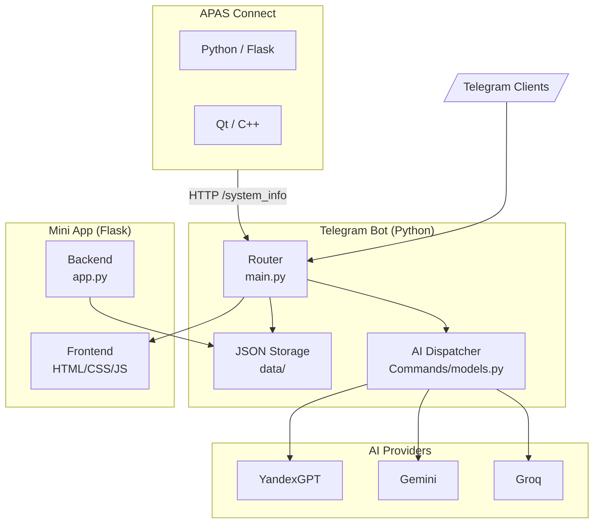
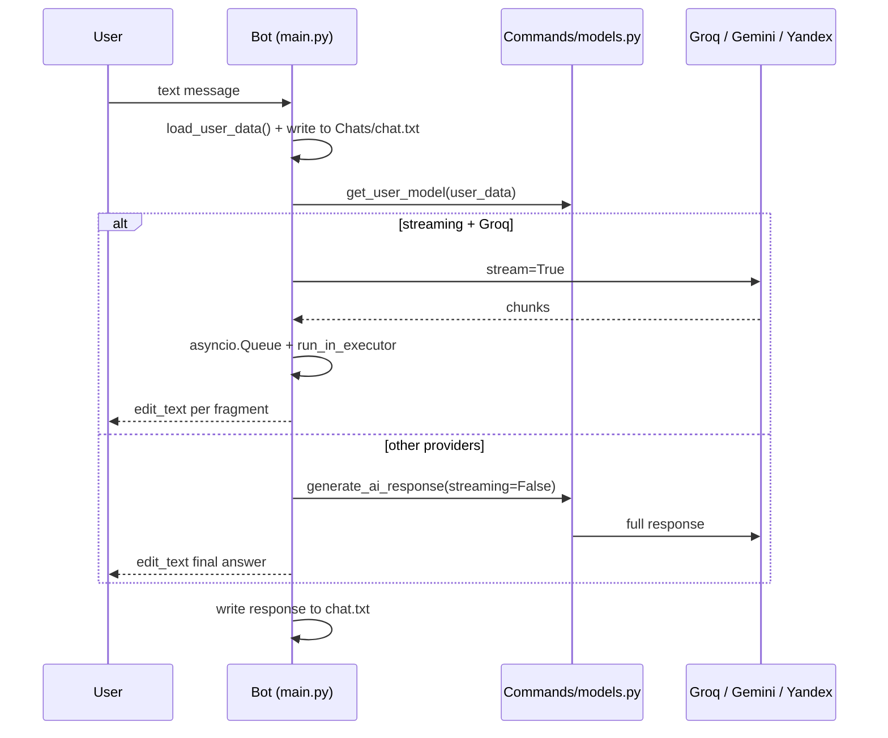
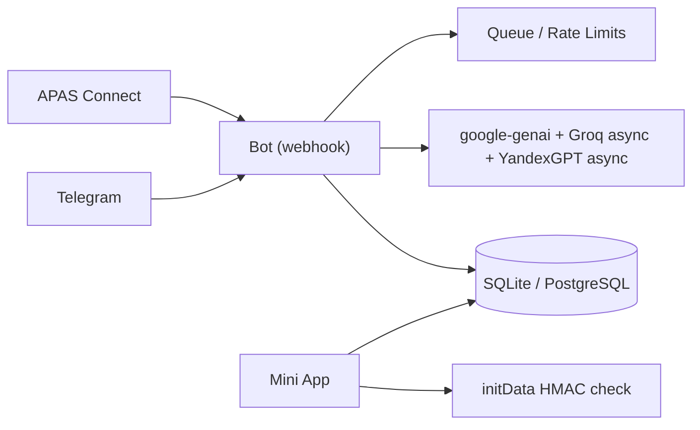

# Architecture — APAS v0.1.0-canary

This document describes the architectural decisions, data flows, and
component interaction schema of the APAS ecosystem. Current for version
`0.1.0-canary`.

---

## System Overview

APAS is an experimental ecosystem of five components:

### Component Roles

| Component | Role | Stack | Launch |
|---|---|---|---|
| **Telegram Bot** | Core: chat, commands, data | Python, python-telegram-bot 22.5 | `python main.py` |
| **Mini App** | Profile/points/settings WebApp | Flask 3.1.2, HTML/CSS/JS | gunicorn (Render/Heroku) |
| **APAS Connect (Python)** | Desktop system info bridge | Flask, pystray, tkinter, psutil | `python main.py` (Windows) |
| **APAS Connect (Qt)** | Remake of the bridge | Qt 6.9.3, C++17, MSVC, CMake | `APASConnectQt.exe` (Windows) |
| **AI Modules** | Model providers | Groq SDK, google-generativeai, requests | library |

---

## Telegram Bot (Core)

### Startup & Event Processing

`main.py` — entry point:

1. Initialize `Application.builder().token(...)` (long-polling).
2. Register 22 `CommandHandler` + `CallbackQueryHandler` + text and
   location handlers.
3. **`button_callback`** — single router for all inline buttons (~60
   callback-data types): checks prefixes in order and delegates to
   command modules.

!!! warning "Known Issue"
    The prefix check order in the router breaks detailed report callbacks
    (`report_` checked before `report_detail_`).
    See [KNOWN-ISSUES: F1](KNOWN-ISSUES.md#f1-report-callback-routing-broken).

4. **Text handler** (`message_filter`) — state chain: guest mode →
   post creation → profile editing → onboarding → report → tools →
   points → ISS Play → Alice mode → image generation → normal AI response.
5. **Location handler** — geolocation processing (onboarding, profile, maps).

### AI Response Flow

### User State

- **Global:** `shared.py` holds `users_data` dict (loaded from
  `data/users_data.json`), `iss_play_accounts`.
- **Session:** `context.user_data` (PTB cache) — `load_user_data()`
  syncs global dict and context on each event.
- **Persistence:** JSON files in `data/`.

### Access Control

| Level | Check | Commands |
|---|---|---|
| **Admin** | `shared.check_admin_access()` (TELEGRAM_ID) | `/reports`, `/tools`, `/addpoints`, `/createpost` |
| **Registered** | `setup_completed` + not guest | most commands |
| **Guest** | `guest_mode` flag (manual check) | `/start`, `/commands`, `/about`, AI chat, `/remote` :warning: |

---

## AI Layer

### Model Modules

| Module | SDK | Models | Notes |
|---|---|---|---|
| `Models/groq.py` | `groq` 0.33.0 | GPT OSS 20B/120B, Kimi K2, Qwen3 32B, Llama 3.1/3.3/4 | Streaming `stream=True` |
| `Models/gemini.py` | `google-generativeai` 0.8.5 :warning: EOL | Gemini 2.0/2.5 (6 models) | System prompt merged with message |
| `Models/yandex.py` | `requests` → Yandex Cloud LLM API | YandexGPT 4/5/5.1 (4 models) | `model_uri` with catalog, temperature 0.6 |
| `Commands/image.py` | `vertexai` (Imagen) | imagen-3.0-generate-001 | :warning: Command not registered |

### Dispatch

`Commands/models.py::generate_ai_response()` — single call point:

- `get_user_model(user_data)` selects model by `selected_model` key
  (default `groq_gpt_oss_120b`);
- Provider routing: `groq` → streaming (async queue),
  others → synchronous call;
- On error: bot offers "Try again" / "Report error".

### System Prompt

`shared.py::get_system_prompt()` — personalized prompt: APAS/ASAD base +
user name, age, city + instruction to intercept account status requests
(routed to `acc_stat_command`).

---

## Geoservices

### Arc Maps (`Modules/arc_maps.py`, 730 lines)

- **Place search:** OpenStreetMap Nominatim (no API key, ~1 rps limit →
  `asyncio.sleep(1.1)`), 2 requests per category, 1-hour cache.
- **Categories:** shops, food, attractions, medical, finance.
- **City detection:** approximate coordinate ranges (Moscow,
  Saint Petersburg), otherwise "Your city".
- **Location analysis:** Groq with streaming (message editing).
- **Callback router** `handle_maps_callback`: coordinates parsed from
  callback_data; branches: nearby places, category settings, distance,
  taxi (go.yandex link), back.
- **Fallback:** static test places on API failure.

### Arc Weather (`Modules/arc_weather.py`)

!!! danger "Mock Implementation"
    Returns hardcoded data (12°C, 65% humidity) regardless of coordinates.
    No real weather API integration.

---

## Alice AI Mode (`Modes/Alice/`)

- `alice.py` — YandexGPT assistant: states in `data/alice_states.json`
  (activity, model Lite/Pro, history up to 10 messages).
- Music router: keywords ("play", "find", "track", "wave"...) →
  `process_music_command`.
- `Commands/yamusic.py` loaded dynamically via
  `importlib.util.spec_from_file_location` (intentional but non-standard).
- **Yandex Music** (`yandex-music` 2.1.0): search, "My Wave"
  (rotor_station_tracks), charts, playlists, likes. Tokens —
  `data/yandex_music_tokens.json`, admin — `YANDEX_MUSIC_ADMIN_TOKEN`.

!!! warning "Known Issues"
    State loss after restart (int/str keys), fake tracks on API errors,
    invalid Markdown from model.     See [KNOWN-ISSUES: F6](KNOWN-ISSUES.md#f6-alice-ai-mode).

---

## Mini App

### Frontend

- Static pages: `index.html` (profile), `points.html`, `settings.html`,
  shared `styles.css`.
- Telegram WebApp client: `tg.initDataUnsafe` (untrusted), dark-themed UI.

### Backend (Flask)

- `static_folder='.'` — serves HTML/CSS/SVG.
- `users_data.json` search across 5 paths (including Render-specific).
- Endpoints: `/api/user-profile`, `/api/weather` (mock),
  `/api/user-settings` (GET/POST), `/api/debug` (vulnerability),
  static `/`, `/points`, `/settings`.

!!! danger "Security (S2)"
    No authentication on any endpoint. CORS allows all origins.
    `/api/debug` exposes system info publicly.
    See [KNOWN-ISSUES: S2](KNOWN-ISSUES.md#s2-mini-app-does-not-authenticate-users-confirmed-on-live-service).

---

## APAS Connect

### Python Version

- Flask server in daemon thread: `GET /system_info` (hostname, OS, CPU,
  RAM, disk, battery), `GET /ping`.
- Data collection — `psutil`; tray icons generated programmatically (PIL),
  Windows theme adaptation via registry (`AppsUseLightTheme`).
- GUI — tkinter: startup window + main window; on close → minimize to tray.
- Build: `build_exe.py` (PyInstaller, onefile, windowed) → `dist/APAS_Connect.exe`.

### Qt Version

- Hand-written HTTP server on `QTcpServer` (port 5000), `GET /system_info`.
- `SystemMonitor` (WinAPI): CPU `GetSystemTimes`, RAM `GlobalMemoryStatusEx`,
  disk C: `GetDiskFreeSpaceEx`, uptime `GetTickCount64`, IP via
  `QNetworkInterface`.
- `TrayIcon`: icon drawn programmatically, menu Show/Quit.
- `MainWindow`: progress bars CPU/RAM/disk, dark/light QSS theme,
  auto-update every 5 seconds.

!!! warning "Known Issues (F10)"
    API check on port 8080 instead of 5000, missing check scripts,
    UI freezes up to 40s.
    See [KNOWN-ISSUES: F10](KNOWN-ISSUES.md#f10-apas-connect-qt).

---

## Data Storage

### JSON Stores (`data/`)

| File | Structure | Writers |
|---|---|---|
| `users_data.json` | `{user_id: {name, age, city, username, points, ...}}` | shared.py, many commands |
| `points_transactions.json` | `[{timestamp, amount, admin_id, admin_name, admin_username}]` | points.py, addpoints.py |
| `reports.json` | `[{user_id, username, full_name, category, issue, description, timestamp, status}]` | report.py, myreports.py, reports.py |
| `iss_play_accounts.json` | `{user_id: {nickname, created_at, linked_to_iss}}` | games.py |
| `alice_states.json` | `{user_id: {active, model, conversation[]}}` | alice.py |

### Dialog Journals

- `Chats/<user_id>/chat.txt` — `User:` / `Bot:` lines, plaintext.
- Mini App has its own (stale) copy of `users_data.json`.

### Limitations

Relative paths, no file locking or atomicity, corrupted JSON silently
becomes `{}`, no migrations or schema versioning.
Details: [KNOWN-ISSUES: A1](KNOWN-ISSUES.md#a1-json-stores-without-protection).

---

## Vulnerabilities & Recommendations

Critical issues in v0.1 architecture (details in [KNOWN-ISSUES](KNOWN-ISSUES.md)):

1. **Mini App without initData check (S2)** — fix first;
2. **Report callback router (F1, F2)**;
3. **IDOR in myreports (S3)**;
4. **`/remote` without access control (S4)**;
5. **`generator.py` RCE chain (S5)**;
6. **Migrate to `google-genai` and current SDKs (A5)**.

---

## Target Architecture (post-v0.1)

- Single DB with migrations and locking;
- Unified auth (initData + admin by ID);
- Async AI calls;
- Tests, CI, pip-audit, secret scan;
- Command menu, webhook, error handler, metrics.
