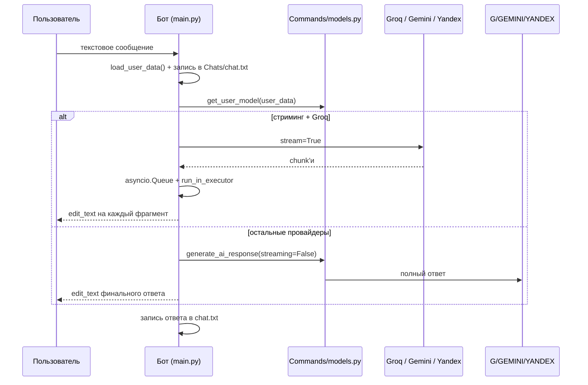

# Архитектура проекта APAS — v0.1.0-canary

> Документ описывает архитектурные решения, потоки данных и схему взаимодействия
> компонентов экосистемы APAS. Актуально для версии `0.1.0-canary`.

---

## 1. Обзор системы

APAS — экспериментальная экосистема из пяти компонентов:

```
┌─────────────────────────────────────────────────────────────────────────┐
│                        Telegram (клиенты пользователей)                 │
│   Пользователь ──┬──► Telegram Bot  ◄─── inline-кнопки, команды        │
│                  └──► Mini App (WebApp в Telegram)                      │
└──────────────────────────┬──────────────────────────────────────────────┘
                           │
              ┌────────────┼────────────────────────────┐
              ▼            ▼                            ▼
       ┌─────────────┐ ┌──────────┐            ┌──────────────────┐
       │ Telegram Bot│ │ Mini App │            │   APAS Connect   │
       │  (Python)   │ │ (Flask)  │            │ Python / Qt      │
       └──────┬──────┘ └────┬─────┘            └────────┬─────────┘
              │             │                           │
              ▼             ▼                           ▼
       ┌─────────────┐ ┌───────────┐            ┌──────────────────┐
       │ ИИ-провайдеры│ │ JSON-данные│           │ 127.0.0.1:5000   │
       │ Groq/Gemini/ │ │ (копия)   │            │ /system_info     │
       │ YandexGPT    │ │           │            └──────────────────┘
       └─────────────┘ └───────────┘
```

### Роли компонентов

| Компонент | Роль | Язык/стек | Запуск |
|---|---|---|---|
| Telegram Bot | Ядро: общение, команды, данные | Python, python-telegram-bot 22.5 | `python main.py` |
| Mini App | Профиль/очки/настройки в WebApp | Flask 3.1.2, HTML/CSS/JS | gunicorn (Render/Heroku) |
| APAS Connect (Python) | Системная информация ПК по HTTP | Flask, pystray, tkinter, psutil | `python main.py` (Windows) |
| APAS Connect (Qt) | То же, ремейк | Qt 6.9.3, C++17, MSVC, CMake | `APASConnectQt.exe` (Windows) |
| ИИ-модули | Провайдеры моделей | Groq SDK, google-generativeai, requests | библиотека |

---

## 2. Telegram Bot (ядро)

### 2.1. Запуск и обработка событий

`main.py` — точка входа:

1. Инициализация `Application.builder().token(...)` (long-polling).
2. Регистрация 22 `CommandHandler` + `CallbackQueryHandler` + текстовый и
   location-хендлеры.
3. **`button_callback`** — единый роутер всех inline-кнопок (~60 типов
   callback-data): проверяет префиксы по порядку и делегирует в модули
   команд.

> ⚠️ Известная проблема: порядок проверки префиксов в роутере ломает
> детальные callback отчётов (`report_` раньше `report_detail_`).
> См. [KNOWN-ISSUES.md](KNOWN-ISSUES.md#f1-сломана-маршрутизация-callback-системы-отчётов).

4. **Текстовый хендлер** (`message_filter`) — цепочка проверок состояния:
   гостевой режим → создание поста → редактирование профиля → онбординг →
   отчёт → инструменты → очки → ISS Play → режим «Алисы» → генерация
   изображения → обычный ИИ-ответ.
5. **Location-хендлер** — обработка геолокации (онбординг, профиль, карты).

### 2.2. Поток ИИ-ответа



### 2.3. Состояние пользователя

- **Глобально:** `shared.py` держит словарь `users_data` (загружается из
  `data/users_data.json`), `iss_play_accounts`.
- **Период сессии:** `context.user_data` (кэш PTB) — `load_user_data()`
  синхронизирует глобальный словарь и контекст при каждом событии.
- **Персистентность:** JSON-файлы в `data/`.

### 2.4. Права доступа

| Уровень | Проверка | Команды |
|---|---|---|
| Админ | `shared.check_admin_access()` (TELEGRAM_ID) | `/reports`, `/tools`, `/addpoints`, `/createpost` |
| Зарегистрированные | `setup_completed` + не guest | большинство команд |
| Гости | флаг `guest_mode` (ручная проверка в каждой команде) | `/start`, `/commands`, `/about`, обычный ИИ-чат, `/remote` (⚠️) |

---

## 3. ИИ-слой

### 3.1. Модули

| Модуль | SDK | Модели | Особенности |
|---|---|---|---|
| `Models/groq.py` | `groq` 0.33.0 | GPT OSS 20B/120B, Kimi K2, Qwen3 32B, Llama 3.1/3.3/4 | стриминг `stream=True` |
| `Models/gemini.py` | `google-generativeai` 0.8.5 ⚠️ EOL | Gemini 2.0/2.5 (6 шт.) | системный промпт склеивается с сообщением |
| `Models/yandex.py` | `requests` → Yandex Cloud LLM API | YandexGPT 4/5/5.1 (4 шт.) | `model_uri` с каталогом, temperature 0.6 |
| `Commands/image.py` | `vertexai` (Imagen) | imagen-3.0-generate-001 | ⚠️ команда не зарегистрирована |

### 3.2. Диспетчеризация

`Commands/models.py::generate_ai_response()` — единая точка вызова:
- `get_user_model(user_data)` выбирает модель по ключу `selected_model`
  (по умолчанию `groq_gpt_oss_120b`);
- маршрутизация на провайдера: `groq` → стриминг (асинхронная очередь),
  остальные — синхронный вызов;
- при ошибке бот предлагает «Попробовать ещё раз» / «Сообщить об ошибке».

### 3.3. Системный промпт

`shared.py::get_system_prompt()` — персональный промпт: база APAS/ASAD +
имя, возраст, город пользователя + инструкция распознавания запросов о
статусе аккаунта (перехват в `acc_stat_command`).

---

## 4. Модули геосервисов

### 4.1. Arc Maps (`Modules/arc_maps.py`, 730 строк)

- **Поиск мест:** OpenStreetMap Nominatim (без ключа, лимит ~1 rps →
  `asyncio.sleep(1.1)`), 2 запроса на категорию, кэш 1 час.
- **Категории:** магазины, еда, достопримечательности, медицина, финансы.
- **Определение города:** приблизительные диапазоны координат (Москва,
  Санкт-Петербург), иначе «Ваш город».
- **Анализ геолокации:** Groq со стримингом (редактирование сообщения).
- **Callback-роутер** `handle_maps_callback`: координаты парсятся из
  callback_data; ветки: места рядом, настройки категорий, расстояние,
  такси (ссылка `go.yandex`), назад.
- **Fallback:** статичные тестовые места при сбое API.

### 4.2. Arc Weather (`Modules/arc_weather.py`)

- ⚠️ **Mock-реализация** (12°C, влажность 65%, фиксированный прогноз).
- Вызывается из карт (кнопка «Погода») и из Mini App.

---

## 5. Режим «Алисы» (`Modes/Alice/`)

- `alice.py` — ассистент на YandexGPT: состояния в `data/alice_states.json`
  (активность, модель Lite/Pro, история до 10 сообщений).
- Музыкальный маршрутизатор: ключевые слова («включи», «найди», «трек»,
  «волна»…) → `process_music_command`.
- `Commands/yamusic.py` загружается динамически через
  `importlib.util.spec_from_file_location` (осознанное, но нестандартное
  решение).
- **Яндекс Музыка** (`yandex-music` 2.1.0): поиск, «Моя волна»
  (rotor_station_tracks), чарты, плейлисты, лайки. Токены —
  `data/yandex_music_tokens.json`, у админа — `YANDEX_MUSIC_ADMIN_TOKEN`.
- ⚠️ Известные проблемы: потеря состояния после рестарта (int/str ключи),
  фейковые треки при ошибках API, невалидная Markdown-разметка от модели.

---

## 6. Mini App

### 6.1. Frontend

- Статические страницы: `index.html` (профиль), `points.html`, `settings.html`,
  общий `styles.css`.
- Клиент Telegram WebApp: `tg.initDataUnsafe` (⚠️ не доверенный), `tg.shareUrl`
  (⚠️ не существует в официальном API), нижняя плавающая навигация.

### 6.2. Backend (Flask)

- `static_folder='.'` — отдаёт HTML/CSS/SVG.
- Поиск `users_data.json` по 5 путям (включая `/opt/render/project/src/...`
  для Render).
- Эндпоинты: `/api/user-profile`, `/api/weather` (мок), `/api/user-settings`
  (GET/POST), `/api/debug` (⚠️ уязвимость), статика `/`, `/points`, `/settings`.
- Асинхронные функции вызываются через `asyncio.new_event_loop()`.

### 6.3. Деплой

- Render / Heroku: `Procfile` (`web: gunicorn app:app`), `runtime.txt`
  (python-3.11.6).

> ⚠️ Вся серверная часть Mini App работает **без аутентификации** — см.
> [KNOWN-ISSUES.md](KNOWN-ISSUES.md#s2-mini-app-не-аутентифицирует-пользователей-подтверждено-на-живом-сервисе).

---

## 7. APAS Connect

### 7.1. Python-версия

- Flask-сервер в daemon-потоке: `GET /system_info` (hostname, OS, CPU, RAM,
  диск, батарея), `GET /ping`.
- Сбор данных — `psutil`; иконки трея генерируются программно (PIL),
  адаптация под тему Windows через реестр (`AppsUseLightTheme`).
- GUI — tkinter: стартовое окно + главное окно; при закрытии — в трей.
- Сборка: `build_exe.py` (PyInstaller, onefile, windowed) → `dist/APAS_Connect.exe`.

### 7.2. Qt-версия

- Рукописный HTTP-сервер на `QTcpServer` (порт 5000), `GET /system_info`.
- `SystemMonitor` (WinAPI): CPU `GetSystemTimes`, RAM `GlobalMemoryStatusEx`,
  диск C: `GetDiskFreeSpaceEx`, uptime `GetTickCount64`, IP через
  `QNetworkInterface`.
- `TrayIcon`: иконка рисуется программно, меню Show/Quit.
- `MainWindow`: прогресс-бары CPU/RAM/диск, тёмная/светлая QSS-тема,
  автообновление каждые 5 сек.
- ⚠️ Баги v0.1: порт 8080 в проверке API, отсутствующие скрипты проверки,
  фриз UI до 40 сек. См. [KNOWN-ISSUES.md](KNOWN-ISSUES.md#f10-apas-connect-qt).

---

## 8. Хранение данных

### 8.1. JSON-хранилища (`data/`)

| Файл | Структура | Пишут |
|---|---|---|
| `users_data.json` | `{user_id: {name, age, city, username, points, ...}}` | shared.py, многие команды |
| `points_transactions.json` | `[{timestamp, amount, admin_id, admin_name, admin_username}]` | points.py, addpoints.py |
| `reports.json` | `[{user_id, username, full_name, category, issue, description, timestamp, status}]` | report.py, myreports.py, reports.py |
| `iss_play_accounts.json` | `{user_id: {nickname, created_at, linked_to_iss}}` | games.py |
| `alice_states.json` | `{user_id: {active, model, conversation[]}}` | alice.py |

### 8.2. Журналы диалогов

- `Chats/<user_id>/chat.txt` — `User:` / `Bot:` строки, открытый текст.
- У Mini App — собственная (устаревшая) копия `users_data.json`.

### 8.3. Ограничения

Относительные пути, отсутствие блокировок и атомарности, повреждённый JSON
молча превращается в `{}`, нет миграций и схем. Подробно:
[KNOWN-ISSUES.md](KNOWN-ISSUES.md#a1-json-хранилища-без-защиты).

---

## 9. Уязвимые места и рекомендации

Критические проблемы архитектуры v0.1 (детали и пути исправления — в
[KNOWN-ISSUES.md](KNOWN-ISSUES.md)):

1. Mini App без проверки initData (S2) — **исправить первым**;
2. Роутер callback отчётов (F1, F2);
3. IDOR myreports (S3);
4. `/remote` без прав (S4);
5. `generator.py` — RCE-цепочка (S5);
6. Переход на `google-genai` и актуальные SDK (A5).

---

## 10. Рекомендуемая целевая архитектура (post-v0.1)


- единая БД с миграциями и блокировками;
- единая аутентификация (initData + администратор по ID);
- асинхронные вызовы ИИ;
- тесты, CI, pip-audit, secret scan;
- командное меню, webhook, error handler, метрики.
