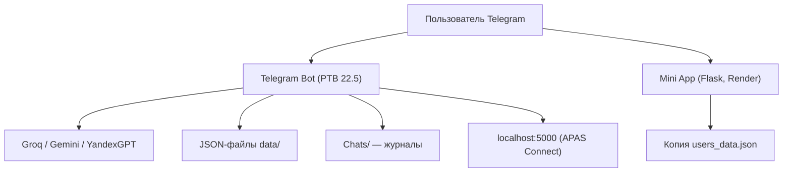

# Аудит №1 — DeepSeek V4 Flash (Max) в OpenCode Desktop

> **Аудит:** №1
> **Инструмент:** DeepSeek V4 Flash (Max), запущенный в OpenCode Desktop
> **Дата:** 02.08.2026
> **Объект:** вся папка проекта `Bot/` (до очистки — 663 МБ)
> **Метод:** полный обзор структуры, чтение всех исходных файлов, подсчёт
> размеров, инвентаризация артефактов сборки и мусора
>
> Данный отчёт — первичный обзорный аудит. Углублённая проверка
> безопасности выполнена во втором аудите (см.
> [AUDIT-02-codex.md](AUDIT-02-codex.md)).

---

## 1. Резюме

Проект — **крупный функциональный прототип** экосистемы APAS: Telegram-бот с
мультимодельным ИИ, Mini App, два десктопных моста (Python и Qt), 4 интеграции
ИИ-провайдеров. Основные выводы:

- **663 МБ** на диске, из которых **~99,5% (≈660 МБ) — пересобираемый мусор**:
  Windows-venv (396 МБ), сборки Qt (182 МБ) и PyInstaller (44 МБ), exe (33 МБ),
  кеши IDE.
- **Полезный «сухой остаток» — менее 3 МБ** кода и данных
  (43 Python-файла ≈ 8 246 строк, 8 Qt-файлов ≈ 21 КБ, Mini App ≈ 33 КБ).
- Обнаружены **секреты** в `.env` и `config.json`.
- Найдены **критические баги**: сломанная админ-панель отчётов, IDOR в
  myreports, `/remote` без проверки прав, мёртвый `generator.py` с RCE-цепочкой.
- **Массовое дублирование кода** — главная архитектурная проблема.

---

## 2. Состав и размеры (на момент аудита)

| Категория | Размер | Статус |
|---|---|---|
| `.venv` | 396 МБ | Windows Python 3.14; на этом Mac не работает |
| `APAS Connect Qt/build` | 182 МБ | CMake/MSVC/Qt Debug+Release, DLL, PDB, OBJ |
| `APAS Connect/build` | 44 МБ | промежуточная сборка PyInstaller |
| `APAS Connect/dist/APAS_Connect.exe` | 33 МБ | готовый Windows-артефакт |
| `.vs` | 4,4 МБ | кеш Visual Studio (Copilot-индексы) |
| `__pycache__` ×7 папок | 396 КБ | пересоздаваемые `.pyc` |
| `.idea` / `.vscode` | ~76 КБ | кеши IDE (в .vscode — битый путь CMake) |
| Полезные исходники и данные | < 3 МБ | код, data/, Chats/, картинки |

**Уточнение:** в `build/APAS_Connect` лежит `APAS_Connect.pkg` (промежуточный
контейнер PyInstaller), а не дубль exe. `dist/APAS_Connect.exe` — единственный
готовый дистрибутив, удалять только при ненадобности.

### Структура полезной части

- `main.py` — 613 строк: роутер команд/callback, стриминг.
- `Commands/` — 22 файла, ~5 230 строк.
- `shared.py` — общие утилиты (users_data, admin, промпты).
- `Models/` — groq.py, gemini.py, yandex.py + 8 логотипов (1,9 МБ).
- `Modes/Alice/` — alice.py + две версии yamusic.py.
- `Modules/` — arc_maps.py (730 строк), arc_weather.py (мок).
- `Mini App/` — Flask: app.py, 3 HTML, CSS, Procfile.
- `APAS Connect/` — main.py (Flask+pystray+tkinter), main_old.py, build_exe.py.
- `APAS Connect Qt/` — 8 файлов C++/h + CMakeLists.
- `data/` — 5 JSON (20 КБ), `Chats/` — 6 диалогов (83 КБ, 797 строк).

---

## 3. Архитектура (по результатам обзора)

Ключевые особенности:

1. **Единый роутер callback** (`button_callback` в main.py) — ~60 типов
   callback-данных, делегирование по префиксам.
2. **JSON-хранилище без БД** — состояние, очки, отчёты, аккаунты.
3. **Мультипровайдерный ИИ** — агрегатор `Commands/models.py` +
   `Models/*`; стриминг только для Groq (asyncio.Queue + run_in_executor).
4. **Персонализированный системный промпт** (имя, возраст, город).
5. **Несколько слабо согласованных прототипов**: у Mini App собственная
   копия данных; Python- и Qt-версии Connect отдают разные JSON-структуры.

---

## 4. Функциональность (по модулям)

### 4.1. Пользователи и онбординг (`start.py`, `guest.py`, `profile.py`)

- Простая регистрация (3 шага) / расширенная (5 шагов: имя, возраст, город,
  уведомления).
- Гостевой режим с ограничением команд; `/signup` для перехода к регистрации.
- Профиль: редактирование, шаринг по deep-link, «удаление».
- Обёртки `TempUpdate` для подмены `update` на callback (хрупко).

### 4.2. Очки (`points.py`, `addpoints.py`)

- Баланс — поле `points` в `users_data.json`; журнал транзакций в
  `points_transactions.json`.
- `/addpoints` (admin): выбор получателя (топ-5 по очкам или @username),
  начисление с уведомлением.
- История с пагинацией (5 записей/стр.); «Заработать больше» — заглушка.
- **Расхождение дефолтов:** 60 (profile/Mini App) vs 0 (points/addpoints).

### 4.3. Отчёты (`report.py`, `myreports.py`, `reports.py`)

- `/report`: категории (генерация текста, профиль, Arc Maps, Arc Weather,
  другое), статусы new/in_progress/resolved/rejected, уведомление админу.
- `/myreports`: список по статусам, детали.
- `/reports` (admin): пагинация, фильтры, архив, смена статусов.
- **Найденные проблемы:** `load_reports` ×3 дубликата; кнопка
  `report_send_empty` не обрабатывается; IDOR в деталях myreports;
  `is_guest_mode()` без аргумента (TypeError); битые emoji.

### 4.4. ИИ и генерация (`models.py`, `image.py`, `generator.py`)

- Агрегатор моделей: Groq (8), Gemini (6), YandexGPT (4).
- `/image` — Imagen 3.0 через Vertex AI; в v0.1 команда **не зарегистрирована**
  в обработчиках; `person_generation="allow_adult"`, `safety_filter_level="block_some"`.
- `generator.py` (625 строк, **не подключён**): генератор Flask-мини-приложений
  с `eval()` в JS и Python, path traversal через `app_name`, `debug=True` —
  потенциальная RCE-цепочка.

### 4.5. Развлечения (`games.py`, `blum.py`, `alice.py`)

- ISS Play: генерация 3 никнеймов через Groq, валидация, привязка аккаунта.
- Blum: приветствия по времени суток; кнопки `blum_settings`/
  `blum_start_dialog` не работают; ложное обещание приватности.
- Alice: YandexGPT Lite/Pro, музыкальный роутер, история 10 сообщений.

### 4.6. Геосервисы (`arc_maps.py`, `arc_weather.py`)

- Maps: Nominatim, 5 категорий, кэш 1 час, определение города по диапазонам
  координат, ссылка Яндекс.Go, fallback на тестовые места.
- Weather: **мок** (12°C, влажность 65%).

### 4.7. Администрирование (`tools.py`, `createpost.py`, `remote.py`)

- `/tools`: чистка `__pycache__`, компиляция, остановка бота; секретная фраза
  **захардкожена в коде** (`'kronos'`).
- `/createpost`: 5 этапов, рассылка по подпискам; Markdown-инъекция через
  текст поста.
- `/remote`: запрос `localhost:5000/system_info` **без проверки прав**.

---

## 5. Найденные проблемы

### 5.1. Критические

1. **Секреты в репозитории** — `.env` с живыми токенами (Telegram, Groq,
   Gemini, Yandex, админ-пароль), `config.json` с токеном бота. Нет `.gitignore`,
   проект не под git.
2. **IDOR в myreports.py** — детали отчётов грузятся по `user_id` из callback
   без проверки владельца.
3. **`/remote` без прав** — раскрытие данных хост-машины.
4. **`generator.py`** — path traversal + eval + debug=True (условная RCE).
5. **`reports.py` сломан** — `is_guest_mode()` без аргумента на строках 195,
   539, 616 → TypeError при каждом admin-callback.
6. **`blum.py` обещает «шифрование и несохранение»** — переписки сохраняются.

### 5.2. Функциональные

- Кнопки `image_edit`, `blum_settings`, `report_send_empty`, `addpoints_confirm`
  не обрабатываются.
- `acc_stat.py` дублирует admin-проверку; `iss.py` перезаписывает `user_id`
  в цикле (безвредно, но опасно).
- Битые emoji/кодировка в `commands.py`, `reports.py`; `print("DEBUG:")` в проде.
- Расхождение дефолтов очков; гостевой режим пропускает обычный ИИ-чат.

### 5.3. Дублирование кода

| Функция | Копий | Файлы |
|---|---|---|
| `load/save_reports` | 3 | report.py, myreports.py, reports.py |
| `load/save_points_transactions` | 2 | points.py, addpoints.py |
| Тумблеры уведомлений | 2 | notifications.py, settings.py |
| Рендер профиля | 4 | внутри profile.py |
| `TempUpdate` | 2 | guest.py, start.py |
| Работа с users_data | 3 | shared.py, arc_maps.py, Mini App/app.py |

### 5.4. Мусор (99,5% диска)

- `.venv` — Windows-окружение (не работает на Mac), 78 пакетов, из них
  ~90 МБ `googleapiclient` (в основном транзитивная зависимость);
- `build/` обоих проектов — полностью пересобираемые;
- `.vs`, `.idea`, `.vscode`, `__pycache__` — кеши;
- мёртвые файлы: `main_old.py`, `generator.py`, `Modes/Alice/yamusic.py`,
  `Modes/Alice/Commands/{commands,modes,exit}.py`.

---

## 6. Права доступа (карта)

| Уровень | Команды |
|---|---|
| Админ | `/reports`, `/tools`, `/addpoints`, `/createpost` |
| Зарегистрированные | `/profile`, `/points`, `/acc_stat`, `/myreports`, `/report`, `/iss`, `/settings`, `/notifications`, `/models`, `/games`, `/blum`, `/image`, `/alice` |
| Без ограничений | `/about`, `/commands`, `/start`, `/guest`, `/signup`, **`/remote` (уязвимость)** |

---

## 7. Данные на момент аудита

- `users_data.json` — 11 записей (6 полноценных профилей, 2 гостя, 2 теста).
- `points_transactions.json` — 8 транзакций (начисления админом, тестовая 9999).
- `reports.json` — 1 отчёт (status: new).
- `iss_play_accounts.json` — 1 аккаунт (linked_to_iss: true).
- `alice_states.json` — 2 состояния (модель lite).
- `Chats/` — 6 диалогов: 1 реальный (715 строк), остальные — тесты.

---

## 8. Рекомендации (кратко)

1. Ротация всех секретов, создание `.gitignore`, инициализация git.
2. Починка `reports.py` и роутера callback; авторизация в `myreports`/`remote`.
3. Чистка мусора (−660 МБ).
4. Вынос дубликатов в общие модули; удаление мёртвых файлов.
5. Переход на актуальные SDK и модели.
