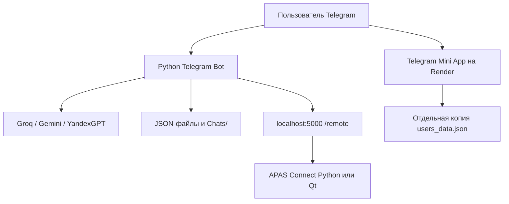

# Аудит №2 — ChatGPT Codex (GPT-5.6 Sol High) + Codex Security

> **Аудит:** №2
> **Инструмент:** ChatGPT Codex (GPT-5.6 Sol High) + Codex Security
> **Дата:** 02.08.2026
> **Объект:** вся папка проекта `Bot/` (до очистки — 671,12 МБ логического
> размера / 662,84 MiB на диске)
> **Метод:** полная индексация 10 515 файлов, чтение исходников и конфигурации,
> инвентаризация бинарников, live-проверка опубликованного Mini App на Render,
> pip-audit в отдельном временном окружении
>
> Отчёт №2 — углублённый аудит, дополняющий и уточняющий
> [Аудит №1 (DeepSeek)](AUDIT-01-deepseek.md).

---

## 1. Итоговая оценка

Проект представляет собой крупный функциональный прототип экосистемы APAS,
но в текущем состоянии **не готов к безопасной эксплуатации**.

| Область | Оценка |
|---|---|
| Функциональные возможности | 6/10 |
| Фактическая работоспособность | 4/10 |
| Безопасность | 2/10 |
| Поддерживаемость | 3/10 |
| Актуальность технологий | 3/10 |
| Готовность к публичному production | 2/10 |

### Главные выводы

1. В папке находятся секреты, похожие на реальные: токены Telegram, Groq,
   Gemini, Yandex, Yandex Music, пароль администратора, а также PFX
   с приватным ключом.
2. Опубликованный Mini App сейчас уязвим: нет проверки Telegram initData,
   API доверяет переданному `user_id`, публичен `/api/debug`, а CORS разрешает
   произвольные сайты.
3. Административная система отчётов фактически сломана одновременно
   неправильной маршрутизацией callback и вызовами `is_guest_mode()` без
   аргумента.
4. Значительная часть доступных в интерфейсе ИИ-моделей уже отключена либо
   указана с неверными ID.
5. Указанная версия `python-telegram-bot` отстаёт от Telegram Bot API на
   несколько больших релизов.
6. 94,36% логического размера можно удалить как полностью пересоздаваемые
   артефакты. Если не нужен готовый `.exe`, доля артефактов достигает 99,51%.
7. Надёжного набора тестов, CI, блокировки версий, миграций данных,
   мониторинга и единого хранилища нет.

---

## 2. Состав и размеры

Проверено **10 515 файлов**. Полностью проиндексированы исходники,
конфигурация, HTML/CSS, JSON-данные, сборочные манифесты и метаданные
бинарников. Сторонние DLL и Python-пакеты инвентаризированы, но не
подвергались полному reverse engineering.

| Показатель | Значение |
|---|---|
| Логический размер | 671 123 375 байт = 671,12 MB / 640,03 MiB |
| Занято на файловой системе | 662,84 MiB |
| Полезный материал (без окружения, сборок, .vs и exe) | 3 315 717 байт = 3,16 MiB |
| Файлов в Windows .venv | 9 945 |
| Рабочих файлов (после исключения артефактов) | 137 |

| Категория | Размер на диске | Статус |
|---|---|---|
| `.venv` | 395,59 MiB | Windows Python 3.14; на этом Mac не работает |
| `APAS Connect Qt/build` | 181,97 MiB | CMake/MSVC/Qt Debug и Release, DLL, PDB, OBJ |
| `APAS Connect/build` | 44,48 MiB | промежуточная сборка PyInstaller |
| `APAS Connect/dist/APAS_Connect.exe` | 32,95 MiB | готовый Windows x64 продукт, не мусор автоматически |
| `.vs` | 4,38 MiB | кэш Visual Studio |
| `__pycache__` вне окружения | 0,34 MiB | 30 пересоздаваемых .pyc |
| Остальные исходники, данные и ресурсы | ~3,47 MiB на диске | полезная часть |

**Без удаления готового `.exe` можно освободить ~633,26 MB логического
размера — 94,36%. Вместе с `.exe` — 667,81 MB, или 99,51%.**

> **Поправка к аудиту №1:** `APAS_Connect.exe` **не продублирован** в `build/`.
> Там находится `APAS_Connect.pkg` — промежуточный контейнер PyInstaller.
> `dist/APAS_Connect.exe` следует сохранить, если нужен готовый дистрибутив.

### Объём исходников

- Python: 43 файла, **9 089 строк** (поправка к аудиту №1: 8 246 строк —
  результат `wc`, падавшего на путях с пробелами).
- C++/заголовки Qt: 690 строк.
- HTML/CSS/JS Mini App: 958 строк.
- Самый новый исходный файл изменён **27 октября 2025** — код не обновлялся
  около девяти месяцев, в течение которых Telegram и ИИ-провайдеры выпустили
  несколько несовместимых обновлений.

---

## 3. Архитектура

**Основная архитектурная проблема: это не единая система, а несколько слабо
согласованных прототипов.**

- Telegram-бот хранит состояние в локальных JSON и каталогах чатов.
- Mini App использует отдельную устаревшую копию `users_data.json`.
- APAS Connect должен быть доступен на localhost самого процесса бота, а не
  компьютера пользователя.
- Python- и Qt-версии Connect возвращают разные структуры JSON.
- Административные и пользовательские callback централизованы в одном длинном
  маршрутизаторе, из-за чего общие префиксы перехватывают более конкретные
  действия.
- Нет схем данных, транзакций, миграций, версионирования формата и блокировок
  при одновременной записи.

---

## 4. Критические проблемы безопасности

### P0: Секреты должны считаться скомпрометированными

В `.env` присутствуют значения:

- `TELEGRAM_BOT_TOKEN`;
- `GROQ_API_KEY`;
- `GEMINI_API_KEY`;
- `YANDEX_API_KEY`;
- `YANDEX_MUSIC_ADMIN_TOKEN`;
- `TELEGRAM_ID`;
- `ADMIN_PASSWORD`;
- идентификаторы Google Cloud.

Также:

- В `config.json` находится отдельный Telegram-токен, который код не использует.
- В Qt Release присутствуют `APASConnectTestCert.pfx` и `.cer`.
  **PFX действительно содержит приватный ключ и открывается паролем из
  `APASConnectConfig.yml` (line 25).** Сертификат самоподписанный, тестовый,
  действителен до 26 октября 2026 года. Для публичной подписи он непригоден,
  а приватный ключ уже нельзя считать секретным.
- Корневого `.gitignore` нет.

**Нужно не просто перенести значения в другой файл, а отозвать и выпустить
заново:**

- Telegram — отозвать токен через BotFather.
- Перевыпустить Groq, Gemini/Google Cloud и Yandex API keys.
- Сменить Yandex Music token и административный пароль.
- Удалить PFX из распространяемых материалов и выпустить нормальный
  production-сертификат.
- Проверить историю облачных загрузок, архивов и резервных копий.

### P0: Mini App не аутентифицирует пользователей

В `Mini App/app.py` (line 23) включён `CORS(app)` для всех доменов. Backend
не получает и не проверяет подписанный `Telegram.WebApp.initData`, а доверяет
числовому `user_id` от клиента. Следствия:

- профиль существующего пользователя можно запросить по ID;
- настройки можно читать и изменять по ID;
- POST настроек позволяет создать произвольного пользователя;
- параметр `setting` не ограничен списком разрешённых полей — **mass
  assignment**;
- злоумышленник может записать, например, `setup_completed` или другие
  внутренние поля;
- `/api/debug` раскрывает ID пользователей, пути файлов и сведения о
  серверном каталоге;
- отдельные JSON-записи выполняются без блокировки и атомарного
  переименования.

Официальная документация Telegram прямо предупреждает, что `initDataUnsafe`
нельзя считать доверенным и что backend должен проверять HMAC-подпись сырого
`initData` и свежесть `auth_date`.

**Live-проверка опубликованного Render-сервиса:**

- главная страница отвечает 200;
- `/api/debug` отвечает 200 без авторизации;
- запрос с `Origin: https://attacker.example` получает
  `Access-Control-Allow-Origin: https://attacker.example`.

То есть уязвимость находится не только в локальном коде — она **активна в
опубликованном сервисе**.

### P0/P1: Публичные профили допускают перебор

Deep-link в `Commands/start.py` (line 19) принимает `profile_<identifier>`.
Помимо username поддерживается исходный Telegram user ID. Зарегистрированный
пользователь может перебором ID получить имя, возраст, город и дату
регистрации другого пользователя. Механизма согласия на публичность профиля
нет.

### P1: `/remote` доступен всем

В `Commands/remote.py` (line 6) нет проверки владельца или администратора.
Любой пользователь может запросить данные машины, доступной боту на
`localhost:5000`.

> **Поправка к аудиту №1:** команда не подключается напрямую к ПК
> пользователя. `localhost` — это хост процесса Telegram-бота. Если бот
> работает на Render/VPS, он увидит контейнер Render/VPS или не найдёт
> Connect вообще.
>
> Дополнительно Python Connect возвращает: `processor`, `ram_total_gb`,
> `disk_total_gb`, `disk_free_gb`. Бот ожидает: `cpu`, `ram_total`,
> `disk_total`, `disk_free`, `ip_address`, `uptime`. Поэтому с Python-версией
> большая часть значений отображается как «Неизвестно». Qt возвращает более
> подходящие имена.

### P1: Данные и приватные переписки сохраняются открытым текстом

В папке присутствуют: 11 локальных пользовательских записей, 6 каталогов
чатов, состояния Alice, отчёты, история баллов, ISS Play аккаунт. Один чат
содержит 715 строк. Чаты и истории Alice хранятся незашифрованными, без
срока удаления и политики retention.

Гостевой режим и `/blum` создают ложное ожидание несохранения: гостевой флаг
записывается в JSON; обычные сообщения гостя пишутся в `Chats/`; `/blum`
обещает приватность, но использует то же логирование.

### P1: Удаление профиля не удаляет данные

В `Commands/profile.py` (line 321) `confirm_delete` очищает только
`context.user_data` и сохраняет пустой объект. Не удаляются:

- сама запись пользователя;
- чаты;
- отчёты;
- история баллов;
- Alice state;
- ISS Play account;
- копия профиля Mini App.

Сообщение о полном и необратимом удалении не соответствует фактическому
поведению.

### Условная RCE в неиспользуемом генераторе

`Commands/generator.py` (line 23) содержит:

- path traversal через `app_name`;
- серверный Python `eval`;
- клиентский JavaScript `eval`;
- stored XSS через `innerHTML`;
- Flask `debug=True` на `0.0.0.0`;
- отсутствие аутентификации.

Это потенциально критическая цепочка RCE/XSS. Но файл **нигде не
импортируется** и сейчас не является достижимой поверхностью атаки. Его
следует удалить либо полностью перепроектировать до включения.

---

## 5. Подтверждённые функциональные ошибки

### Система отчётов

- `main.py` (line 171) сначала проверяет `data.startswith('report_')`, а
  только затем `report_detail_` и `report_status_`. Более общий префикс
  перехватывает детальные callback.
- Аналогично `main.py` (line 186) отправляет `myreports_detail_...` в общий
  `handle_myreports_callback`, где такого действия нет.

Следствия:

- просмотр деталей отчётов не вызывается;
- смена статуса не вызывается;
- детальный просмотр собственных отчётов не вызывается;
- потенциальный IDOR в `myreports.py` существует, но **сейчас недостижим**
  из-за другой ошибки маршрутизации;
- **после исправления маршрутизатора IDOR станет доступен, если одновременно
  не проверить `query.from_user.id`**.

Кроме того, в `reports.py` (line 195) на строках 195, 539 и 616 вызывается
`is_guest_mode()` без обязательного `user_data`, что приводит к TypeError.

Кнопка `report_send_empty` создаётся, но не обрабатывается.

### Гостевой режим

В `Commands/guest.py` (line 97):

- `guest_back` вызывает `start_command` с callback-`update`, у которого
  `update.message is None`;
- `guest_commands` аналогично вызывает обработчик обычной команды через
  callback;
- ожидаемы `AttributeError` или попытка использовать отсутствующий `message`;
- заявленное ограничение гостя не мешает обычному AI-чату через главный
  текстовый handler.

### `/image` отсутствует как команда

`image_command` реализован и импортирован, но в `main.py` (line 459) нет
`CommandHandler("image", image_command)`. Также отсутствует callback для
`image_edit`. Поэтому генерация изображений фактически недоступна из
нормального интерфейса.

### Alice

- ID пользователей в `alice_states.json` после чтения становятся строками,
  но часть кода ищет целочисленный ID. Состояние теряется после перезапуска.
- `/exit`, `/commands`, `/modes`, `/music`, `/yamusic` проверяются внутри
  текстового обработчика, но основной handler исключает `filters.COMMAND`;
  отдельные `CommandHandler` не зарегистрированы.
- Ответ YandexGPT отправляется с `parse_mode='Markdown'` без экранирования,
  поэтому модель может сформировать невалидную разметку.
- Yandex Music API инициализируется при импорте и может замедлить или сорвать
  запуск.
- При ошибке возвращаются тестовые треки, внешне похожие на реальные
  результаты.
- «Воспроизведение музыки» возвращает сведения о треке, но не передаёт и не
  проигрывает аудио.
- Использование имени и образа «Алиса» не означает интеграцию с официальным
  голосовым помощником: это YandexGPT с системным промптом.

### Mini App frontend

- В `Mini App/index.html` (line 129) запрашивается несуществующий элемент
  `issCity`. Обращение к `.textContent` вызывает ошибку и прерывает обновление
  профиля.
- Backend отдаёт дату в формате `dd.mm.YYYY`, а frontend передаёт её в
  `new Date()`, что часто даёт `Invalid Date`.
- Баланс 60 захардкожен на нескольких страницах.
- Погода полностью фиктивна.
- Вызывается `tg.shareUrl`, которого нет в официальном Telegram Mini Apps
  API (официально доступны `shareMessage`, `shareToStory` и
  `openTelegramLink`, но не `shareUrl`).
- Подключён Telegram script без актуального `?63`.

### Хранилище JSON

Практически все JSON-хранилища имеют одинаковые проблемы:

- относительные пути зависят от текущего рабочего каталога;
- нет file lock;
- запись выполняется непосредственно в основной файл;
- параллельные handlers могут потерять изменения;
- при повреждённом JSON функции часто возвращают `{}` или `[]`;
- следующая запись способна окончательно затереть данные;
- нет схемы, миграций, резервного копирования и контроля версий.

---

## 6. APAS Connect

### Python-версия

**Положительные стороны:**

- bind выполняется на `127.0.0.1`, а не на публичный интерфейс;
- существуют `/ping` и `/system_info`;
- собираются реальные системные показатели;
- есть tray UI и сборка PyInstaller.

**Проблемы:**

- `requirements.txt` содержит `tkinter`, который является частью стандартной
  библиотеки и не устанавливается через pip. Обычный
  `pip install -r requirements.txt` завершится ошибкой.
- `winreg` делает приложение строго Windows-ориентированным.
- Токен в `config.json` не используется.
- Импорты `requests` и `subprocess` частично не используются.
- `main_old.py` является устаревшей копией.
- Единственный тест запускает GUI-приложение и затем делает HTTP-запросы —
  это не изолированный автоматический тест.

### Qt-версия

Сборка: Qt 6.9.3, C++17, MSVC 2022, Windows x64.

Подтверждённые ошибки:

- `MainWindow.cpp` (line 177) проверяет порт 8080, сервер слушает 5000;
- запускаются отсутствующие `check_models.py` и `check_vertexai.py`;
- inline `python -c` использует некорректную однострочную конструкцию
  `try/except`;
- `waitForFinished(10000)` вызывается четыре раза в UI-потоке — окно может
  зависнуть примерно на 40 секунд;
- `/ping` отсутствует;
- HTTP-route проверяется через `contains("GET /system_info")`, поэтому
  совпадёт и `/system_infoevil`;
- нет `Content-Length`, полноценного HTTP-парсера и аутентификации;
- CPU и диск ориентированы только на Windows и диск C:;
- название процессора захардкожено как `x64 Processor`;
- кнопка сетевой проверки не задаёт явный timeout.

---

## 7. Зависимости и актуальность

Автоматический `pip-audit` запускался в отдельном временном окружении:

| Набор | Результат |
|---|---|
| Корневой бот | 31 известная уязвимость в разрешённом дереве зависимостей |
| APAS Connect | 23 |
| Mini App | 3 |

Это число advisory-срабатываний, а не 57 уникальных CVE — наборы
пересекаются. Затронуты: `requests`, `python-dotenv`, `Pillow`, `Flask`,
`urllib3`, `aiohttp`, `click`.

| Технология | В проекте | Актуальное состояние |
|---|---|---|
| python-telegram-bot | 22.5 | 22.8 |
| Groq SDK | 0.33.0 | 1.6.0 |
| google-generativeai | 0.8.5 | проект закрыт и не поддерживается |
| requests | 2.32.5 / 2.31.0 | 2.34.2 |
| python-dotenv | 1.1.1 | 1.2.2 |
| Pillow | 10.0.1 | 12.3.0 |
| Flask | 2.3.3 / 3.1.2 | 3.1.3 |
| yandex-music | 2.1.0 | 3.0.0 |
| Qt | 6.9.3 | доступна линия 6.11; 6.8 — LTS-вариант |

Дополнительно:

- README заявляет Python 3.7+, но это уже неверно: текущие PTB и Groq требуют
  Python 3.10+. Windows `.venv` содержит Python 3.14, системный Python на
  Mac — 3.9.6. Практичный вариант — единый Python 3.12 или 3.13 с новым
  нативным окружением и lock-файлом.
- `google-generativeai` помечен Google как **inactive**; поддержка окончательно
  закончилась **30 ноября 2025 года**. Нужна миграция на `google-genai`.
- Генеративные модули `vertexai.*` удалены из поддерживаемого Vertex AI SDK
  после **24 июня 2026 года**.

---

## 8. Состояние ИИ-моделей

### Groq

Рабочими выглядят:

- `openai/gpt-oss-20b`;
- `openai/gpt-oss-120b` — текущая модель по умолчанию.

Проблемные:

| Модель в проекте | Проблема |
|---|---|
| `kimi-k2-instruct-0905` | нет префикса `moonshotai/`, модель отключена 15.04.2026 |
| `qwen3-32b` | нет `qwen/`, модель отключена 17.07.2026 |
| `llama-4-maverick...` | нет `meta-llama/`, отключена 09.03.2026 |
| `llama-4-scout...` | нет `meta-llama/`, отключена 17.07.2026 |
| `llama-3.1-8b-instant` | будет отключена 16.08.2026 для free/developer tier |
| `llama-3.3-70b-versatile` | будет отключена 16.08.2026 для free/developer tier |

Рекомендованные замены: GPT OSS 20B/120B либо `qwen/qwen3.6-27b`.

### Gemini

- `gemini-2.0-flash-exp` отключена 9 декабря 2025 года.
- `gemini-2.0-flash` и `gemini-2.0-flash-lite` отключены 1 июня 2026 года.
- Gemini 2.5 Flash/Lite/Pro ещё работают, но запланированы к отключению
  16 октября 2026 года.
- Рекомендуемые линии: Gemini 3.6 Flash, 3.5 Flash-Lite и 3.1 Pro Preview.

То есть **половина Gemini-кнопок сейчас гарантированно приводит к ошибке API**.

### YandexGPT

- YandexGPT 5 Lite, 5 Pro и 5.1 Pro остаются актуальными.
- YandexGPT 4 отсутствует в актуальном перечне моделей (июнь 2026), поэтому
  его наличие в интерфейсе нужно перепроверить через API каталога перед
  показом пользователю.

### Imagen

- `imagen-3.0-generate-001` всё ещё документирован Google.
- Основная поломка здесь не модель, а удалённый API-модуль
  `vertexai.preview.vision_models` и отсутствие регистрации `/image`.

---

## 9. Сравнение с Telegram Bot API

На дату аудита актуален Telegram Bot API 10.2 (14 июля 2026). Проект
использует PTB 22.5, основанный на поддержке Bot API 9.2. PTB 22.8
поддерживает Bot API 10.0, но ещё не 10.1/10.2.

**Особенно полезные отсутствующие возможности:**

- **`sendMessageDraft`** — возможность нормально стримить частичный AI-ответ.
  Сейчас проект редактирует сообщение на каждый Groq chunk, создавая риск
  flood limits, BadRequest и превышения 4096 символов.
- **Rich Messages и `sendRichMessageDraft` (Bot API 10.1)** — оптимальное
  направление для APAS: структурированные заголовки, списки, таблицы,
  математика, цитаты, thinking blocks, картинки и потоковая выдача без
  ручного Markdown.
- **Нативный guest mode (Bot API 10.0)** — не совпадает с внутренним флагом
  `guest_mode` проекта; Telegram guest mode позволяет ботам отвечать в чатах,
  где бот не является участником.
- **Ephemeral Messages (10.2)** — сообщения, видимые только конкретному
  пользователю и боту. Могут быть полезны для приватных административных
  операций и профилей.
- **Приватные topics** — можно разделить обычный AI-чат, карты, Alice,
  поддержку и отчёты по темам вместо глобальных mode-флагов.
- **Стили и custom emoji для кнопок (Bot API 9.4)** — цветовые стили кнопок
  и custom emoji.
- **Медиа-опросы, live photos, расширенные polls** — не используются.
- **Managed bots, communities, subscriptions, bot-to-bot communication** —
  не обязательны для текущего продукта, но полностью отсутствуют.
- **Командное меню** — в коде нет `setMyCommands`, поэтому список команд не
  синхронизируется программно с реальными handlers.
- **Webhook/масштабирование** — используется только `run_polling()`. Нет
  webhook, фильтра `allowed_updates`, стратегии повторного запуска и
  управления накопившимися updates.

**Mini Apps:** проект не использует актуальные возможности: `shareMessage`,
SecureStorage/DeviceStorage, biometrics, location manager, акселерометр,
гироскоп, orientation, `requestChat`, `hideKeyboard`, safe-area API,
fullscreen/orientation lock, проверку версии клиента перед вызовом новых
методов. Критический пробел — именно серверная проверка `initData`, а не
отсутствие сенсоров.

---

## 10. Производительность и качество кода

- Gemini и Yandex вызываются синхронно внутри `async def`, блокируя event loop.
- Yandex `requests.post` не имеет timeout.
- Карты выполняют синхронные HTTP-запросы и последовательные задержки внутри
  async handler.
- Groq использует thread executor, но редактирует Telegram-сообщение на каждый
  фрагмент.
- Нет пользовательских/глобальных лимитов запросов.
- Нет ограничения длины prompt.
- Нет quota/cost control.
- Нет content moderation и abuse protection.
- Нет глобального `Application.add_error_handler`.
- Контекст обычного AI-диалога не передаётся модели: каждый запрос состоит из
  system prompt и текущего сообщения.
- Чат сохраняется на диск, но не используется как память модели.
- PII профиля передаётся внешним ИИ-провайдерам без отдельного согласия.
- Баланс по умолчанию расходится: 60 в профиле/Mini App и 0 в
  points/addpoints.
- Найдены 6 явных символов повреждённой кодировки `�`.
- В production-коде осталось не менее 32 `print`, включая debug-вывод.

---

## 11. Сравнение с аудитом №1 (DeepSeek)

### Что в отчёте №1 верно

Отчёт DeepSeek в целом неплохо описал структуру и главные проблемы. Особенно
точно выявлены:

- соотношение исходников и артефактов;
- секреты;
- `is_guest_mode()` без аргумента;
- Mini App без initData;
- `/remote`;
- мёртвый `generator.py`;
- устаревшая копия Mini App данных;
- порт 8080 в Qt;
- отсутствующие Qt check-скрипты;
- фиктивная погода;
- захардкоженные points.

### Поправки к отчёту №1

1. IDOR myreports **сейчас недостижим**, потому что callback перехватывается
   неправильной веткой роутера. После ремонта роутера станет достижимым, если
   отдельно не добавить авторизацию.
2. `generator.py` не является текущей RCE-поверхностью, потому что нигде не
   подключён. Это критический условный риск при его включении.
3. `dist/APAS_Connect.exe` не дублируется в `build`. В `build` лежит `.pkg`,
   а не второй `.exe`.
4. Мёртв не весь каталог Alice commands. Активный
   `Modes/Alice/Commands/yamusic.py` загружается динамически. Другие
   command-файлы в основном действительно не подключены.
5. Полезного Python-кода больше: **9 089 строк**, а не около 8 246.
6. Количество ИИ-провайдеров завышено: GigaChat представлен только
   логотипом, работающей интеграции нет.
7. `googleapiclient` нельзя считать просто ненужным пакетом: значительная
   часть Google client stack является транзитивной зависимостью
   `google-cloud-aiplatform`, хотя эта зависимость слишком тяжёлая для
   единственной функции Imagen.

### Что не было выявлено в отчёте №1

- PFX с приватным ключом и паролем;
- публичная активность `/api/debug` на Render;
- mass assignment в настройках Mini App;
- сломанная маршрутизация отчётов;
- ложное удаление профиля;
- перебор публичных профилей;
- несовместимые структуры Python Connect и бота;
- неработающие гостевые callback;
- проблемы состояния Alice после перезапуска;
- массово отключённые Groq/Gemini-модели;
- удаление Vertex AI SDK-модулей;
- отсутствие `/image` в handlers;
- invalid `tkinter` requirement;
- отсутствие тестов, CI и lock-файла.

---

## 12. Рекомендуемый порядок исправлений

### Немедленно

1. Отозвать все секреты и PFX.
2. Временно закрыть `/api/debug`.
3. Запретить Mini App API до добавления проверки Telegram initData.
4. Ограничить CORS собственным доменом.
5. Закрыть запись настроек по произвольному `user_id`.
6. Сделать резервную копию JSON и чатов перед любыми изменениями.
7. Ограничить `/remote`, `/reports`, `/addpoints`, `/tools`, `/createpost`
   одним Telegram ID администратора.

### Затем

1. Исправить порядок callback-маршрутов.
2. Исправить три вызова `is_guest_mode`.
3. Добавить проверку владельца в `myreports`.
4. Реализовать настоящее удаление всех связанных данных.
5. Исправить гостевые callback.
6. Удалить неработающие модели из интерфейса.
7. Перейти с `google-generativeai` и старого Vertex SDK на `google-genai`.
8. Перейти на AsyncGroq и асинхронный HTTP-клиент для Yandex/карт.

### Инфраструктура

1. Создать новый нативный Python 3.12/3.13 environment.
2. Разделить requirements для bot, Mini App и Connect.
3. Добавить lock-файл с hash pinning.
4. Инициализировать Git и строгий `.gitignore`.
5. Перенести данные в SQLite/PostgreSQL либо хотя бы добавить атомарные
   JSON-записи и lock.
6. Создать unit/integration тесты для callback router, прав доступа и
   Mini App auth.
7. Добавить CI: tests, Ruff, mypy/pyright, pip-audit, secret scan.
8. Добавить журналирование без PII, метрики и глобальный error handler.

### Чистка

Безопасно пересоздаются: `.venv`, `.vs`, `APAS Connect/build`,
`APAS Connect Qt/build`, все `__pycache__`.
`APAS Connect/dist/APAS_Connect.exe` удалять только если готовый
Windows-дистрибутив не нужен.

---

## 13. Итог

База проекта пригодна для продолжения разработки, но сначала нужен отдельный
этап **security remediation**. Простого обновления библиотек недостаточно —
ключевые риски находятся в авторизации Mini App, маршрутизации callback,
обращении с секретами и архитектуре хранения данных.
